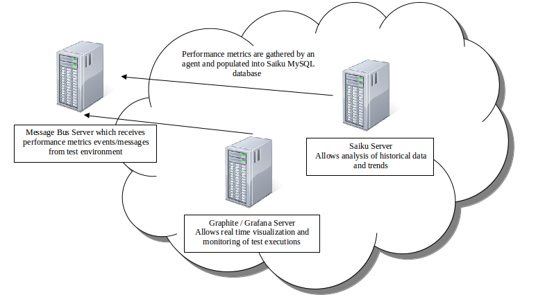

<head>
    <title>Environment Setup</title>
</head>

#Setting up a Performance Monitoring Environment

##vApp Layout

Performance vApp consists of VMs running the following

* Saiku,
* MySQL database with predefined schema
* Java Agent to persist messages to MySQL from Message Bus Exchange.
* Graphite
* Grafana

##Setup

Performance vApp template is available in the TE_TAF catelogue in the cloud portal.

Alternatively the environment can be installed using the following options

**Note** These steps should only be used by advanced users who have specific needs not met by the vApp template.

* puppet [scripts](../advanced_developer/environment_set_up_using_puppet.html) - for use when deploying on vApp
* Shell installation [scripts](../advanced_developer/environment_set_up_using_scripts.html) - can only be used on stand alone vms or physical systems

##Metrics Sending Components

Metrics are sent to the Performance vApp via MB by the following components

* [Metrics Builder](../overview/solutions/metrics_builder.html)
* [DDC](../overview/solutions/ddc.html)
