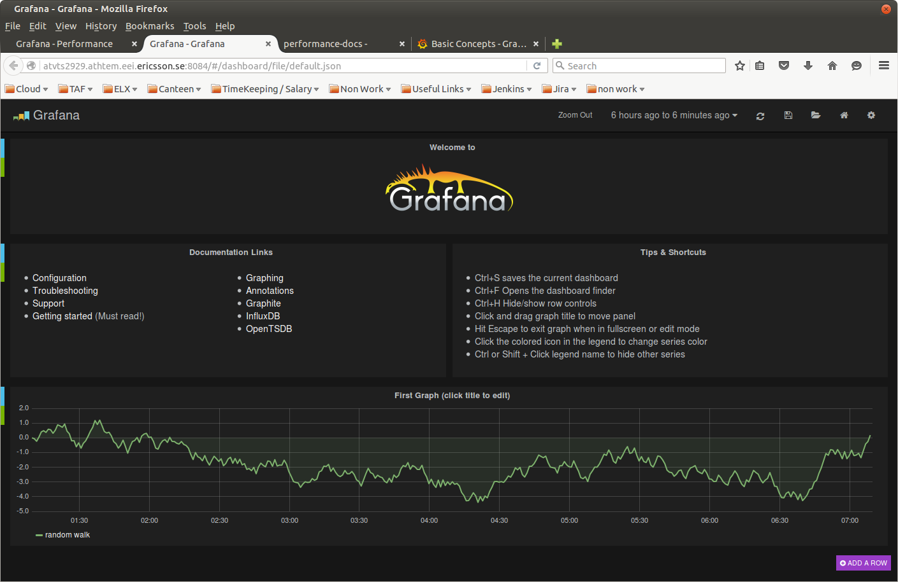
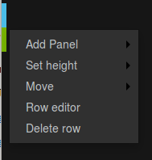
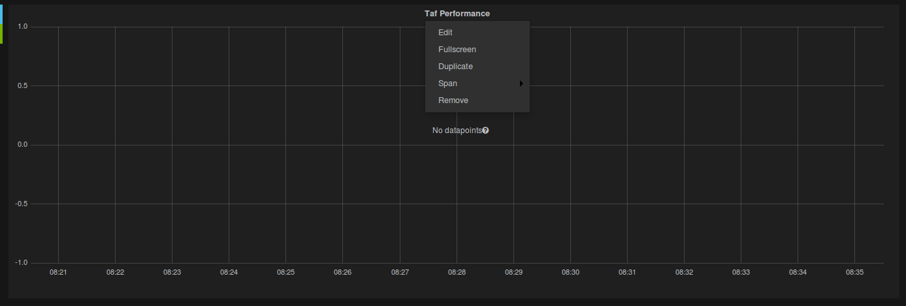
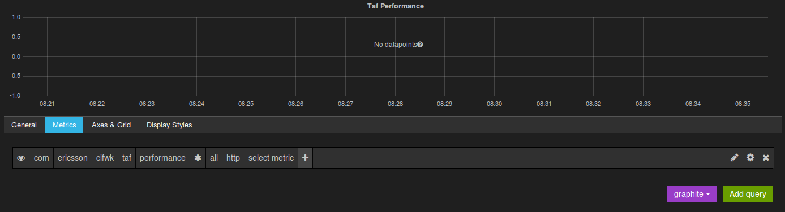
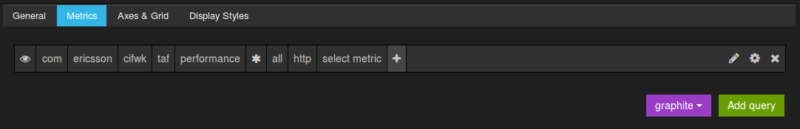
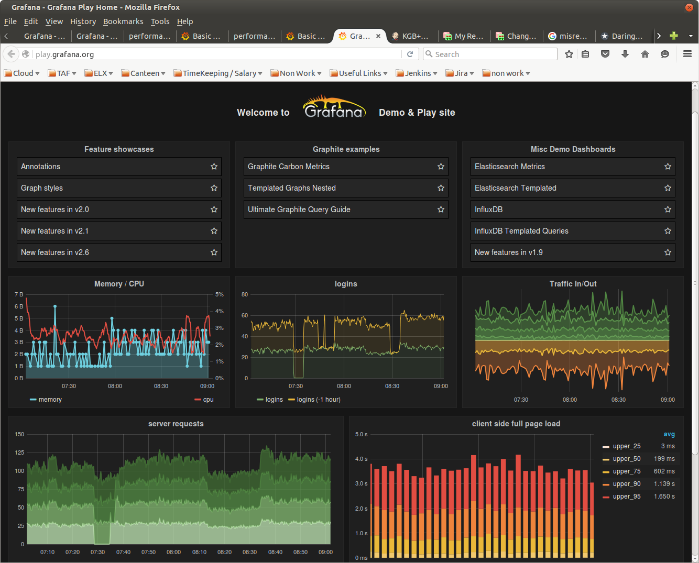

<head>
    <title>Grafana Usage</title>
</head>

#Grafana Usage

##Accessing Grafana

Grafana is available on port 8084 of the performance vApp.

Replace XXXX with vApp hostname where Saiku is installed - atvtsXXXX.athtem.eei.ericsson.se:8084

##Configuring Grafana

Once you access the webpage, you can now configure Grafana to visualize your performance metrics.

First you must add a row, this is a place holder / container for panels (graphs or text).

Once you add the row, there will be 2 options available via blue and green tabs on the left.
Blue tab allows you to rename.
Both provide options to configure the row, by adding panels (graphs or text), size, etc)

Next add a graph to your row and select edit

In here you have the options to make general update, such as name, size, etc.

To specify the metrics you want to monitor select the metrics tab and select the metrics in question in the query builder.

##Example Grafana Page

Here is an example of what can be visually achieved with Grafana.

[Live Demo](http://play.grafana.org/)
