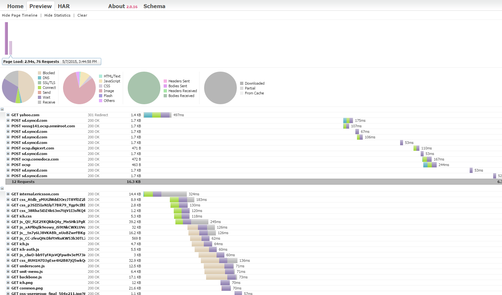

<head>
    <title>TAF UI With Performance Data via HAR format</title>
</head>

#Extending TAF UI with performance data via HAR format

This page describes how it is possible to extend TAF UI with [BrowserMob](http://bmp.lightbody.net/) proxy and gather performance data in HAR format.

##HAR format

HAR stands for HTTP Archive. This is a common format for recording HTTP tracing information.
This file contains a variety of information, but for our purposes, it has a record of each object being loaded by a browser.
Each of these objects’ timings is recorded.

You should expect the HAR file to include a breakdown of timings including:

* How long it takes to fetch the DNS information
* How long each object takes to be requested
* How long it takes to connect to the server
* How long it takes to transfer from the server to the browser of each object
* Whether the object is blocked or not

More info about the format [here](https://www.maxcdn.com/one/visual-glossary/har-file/?utm_source=text)

###HAR viewers

HAR files can be viewed online via:

* [janodvarko](http://www.janodvarko.cz/har/viewer/) ([open source project](https://github.com/janodvarko/harviewer))
* [softwareishard](http://www.softwareishard.com/har/viewer/)

##Extending TAF UI
1.Include maven dependency for browserMob proxy:

Maven dependency

    <dependency>
        <groupId>net.lightbody.bmp</groupId>
        <artifactId>browsermob-proxy</artifactId>
        <version>2.0.0</version> <!--latest version here-->
    </dependency>

2.Start BMP proxy server:

Creating browser mob proxy

    import net.lightbody.bmp.proxy.ProxyServer;

    ProxyServer proxy = new ProxyServer(9090);
    Map<String, String> mobProxyServerOptions = new HashMap<String, String>();
    proxy.start();
    proxy.setOptions(mobProxyServerOptions);
    proxy.setCaptureHeaders(true);
    proxy.setCaptureContent(true);
    proxy.setCaptureBinaryContent(true);

3.Initialize browser with proxy settings:

UI.browser initialization

    Proxy seleniumProxy = new Proxy();
    seleniumProxy.setHttpProxy("localhost:9090");

    //create browser
    this.browser = UI.newBrowser(new BrowserSetup.Builder().withCapability(CapabilityType.PROXY, seleniumProxy).withType(BrowserType.FIREFOX));

4.Operate with proxy object during the tests in order to capture metrics and separate them logically:

Capture HAR and pages

    proxy.newHar("MyNewTest");

    BrowserTab browserTab = browser.open(url);
    //do actions on a page

    proxy.endPage();
    proxy.newPage("newPage");

    browser.open(url2);
    //do actions on new page
    proxy.endPage();

    proxy.getHar().writeTo(new File("myNewTest-har.har"));

At this point you get HAR archive and are able to view it in the viewers specified above.

##Examples

[example.har](file/../../example.har)

##Additional steps for Windows users

Windows users should create 2 files in their temp directory -C:\Users\<user>\AppData\Local\Temp:

userAgentString.properties

    lastUpdateCheck=200000000000000
    currentVersion=1

and empty userAgentString.txt file.

This is due to https://github.com/webmetrics/browsermob-proxy/issues/66
