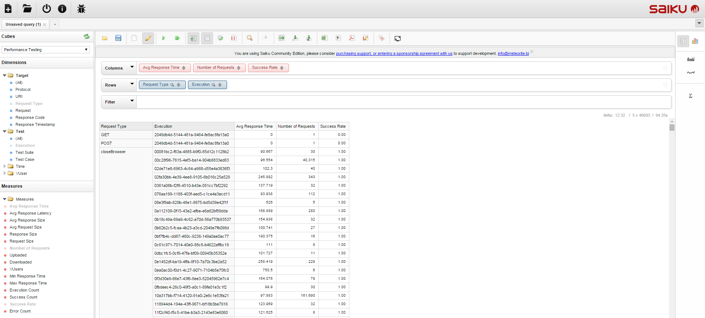

<head>
   <title>Solutions - OLAP Analytics</title>
</head>

# OLAP (Online Analytical Processing)

TAF Performance module provides **Saiku** tool for analysing performance metrics.

Saiku allows business users to explore complex data sources,
using a familiar drag and drop interface and easy to understand business terminology, all within a browser.

Data published with [Metrics Builder](metrics_builder.html) is automatically mapped on Saiku schema.

Select the data you are interested in, look at it from different perspectives, drill into the detail.
Saiku allows to save results, share them, export to Excel or PDF, all straight from the browser.

However, Saiku is _**not a realtime**_ analytics system. Reports are based on available data at request moment.

