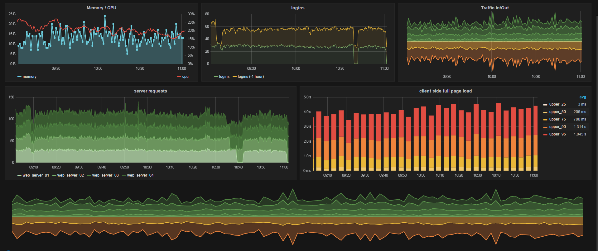

<head>
   <title>Solutions - Real Time Analysis</title>
</head>

# Real time analytics

For real time data visualization TAF Performance modules set up **Grafana dashboard**.

[Grafana](http://grafana.org/) is most commonly used for visualizing time series data for infrastructure and application analytics.

With **Grafana** you are able:

* Create fast and flexible client side graphs with a multitude of options.
* Create dashboards with multiple panels in it.
* Perform custom queries

