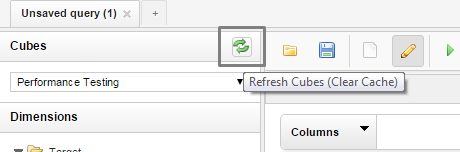

<head>
   <title>Saiku FAQ</title>
</head>

# Saiku FAQ

### Can I see metrics update in real time?

No, Saiku is not a real time analytics system. Report is build with data available at request time.

### How does Saiku retrieve the metrics?

Saiku retrieves metrics from local MySQL database.

### How can I publish metrics to Saiku?

You can use [Metrics Builder](../overview/solutions/metrics_builder.html) to publish metrics in AMQP. Configured java agent will persist these metrics to
MySQL database which is used by Saiku.

Java agent is installed and configured together with Saiku with Puppet scripts.

### Why report doesn't show latest data from my execution?

Saiku caches report data. You can refresh cache to get latest data.

### Can I save my report template?

Yes, report template can be saved from top menu and accessed by other users.

### Who uses Saiku for performance tests?

[Spotfire team](https://gerrit.ericsson.se/#/admin/projects/OSS/com.ericsson.eniq.events/spotfire_performance_test) used Saiku to analyse performance metrics from UI Tests execution with PhantomJS.
Other teams used Saiku to analyse HTTP Tool and CLI tool execution metrics.

