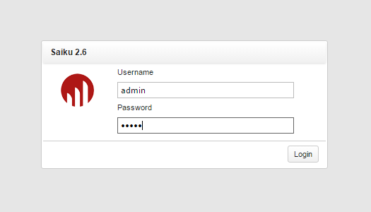
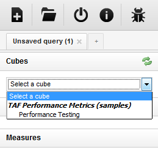
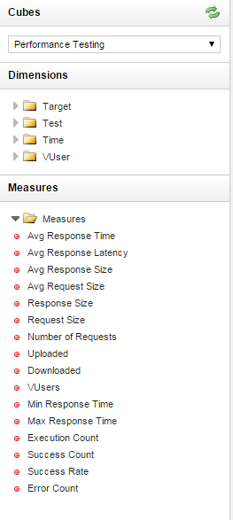
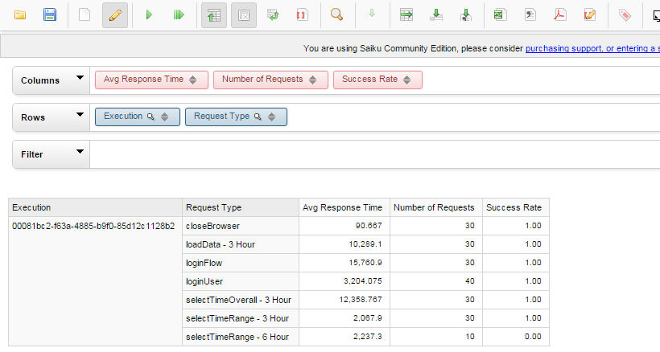
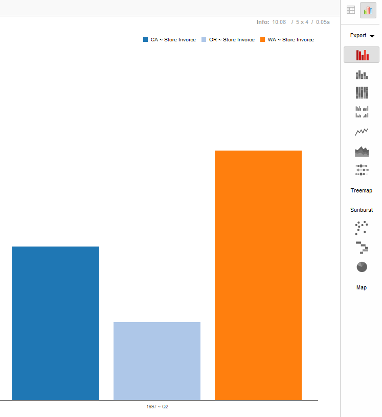
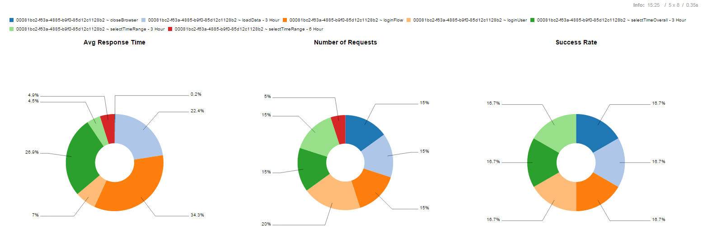
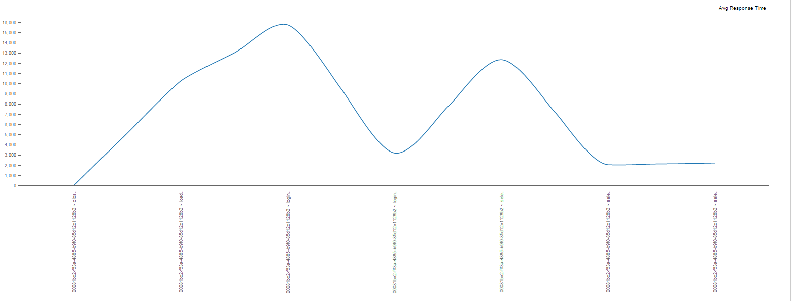

<head>
   <title>Saiku Usage</title>
</head>

# Saiku usage

### Accessing Saiku

Saiku is available on port 8082 under /saiku-ui resource.

Replace **XXXX** with vApp hostname where Saiku is installed - atvts<b>XXXX</b>.athtem.eei.ericsson.se:8082/saiku-ui

Default user is admin/admin.

The next step after being logged in is to select **_cube_** (multi-dimensional array of data) from the left menu.

After cube selection user can see available *dimensions* and *measures*.

A Dimension is a structural attribute of a Cube that is a list of related names–known as Members–all of which belong to a similar
category in the user’s perception of a data. For example, months and quarters may make up a Months dimension;
likewise all cities, regions and countries may make up a Region dimension.
A Dimension acts an index for identifying values within a multidimensional array and offers a very concise,
intuitive way of organizing and selecting data for retrieval, exploration and analysis.

**Dimensions are the business parameters normally seen in the rows and columns of a report.**

**The non-keys are numeric values and are called Measures.**

### Report construction

At this step user is able to build report out of available data.

For example, let's build report with **average command response time**, **number of requests** and **success rate** per execution.

_NOTE! Before building reports disable automatic execution (second green play button in command panel)._

Select **Execution** from Test dimension and **Request type** from Target dimension.
Select **Avg. response time**, **Number of requests** and **Success rate** from measures.

Press "Run Query".

You will be able to see report grouped by execution and commands.
Additionally users are able apply filtering on properties, add more dimensions etc.

### Visualization options

User can access visualization options on the right side and visualize table data in desired format.

#### Example 1

#### Example 2

