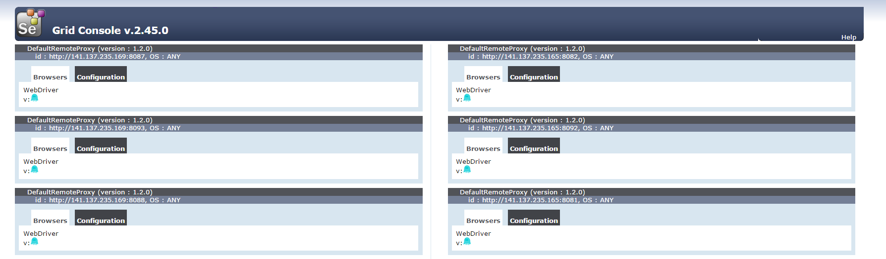

<head>
   <title>UI Testing Pre-requisites</title>
</head>

# Headless UI Testing prerequisites

To run Selenium tests in parallel you will require properly set up Selenium grid with PhantomJS browsers.
The size of Selenium grid will define how many concurrently tests you can execute at the same time.

PhantomJS is **_significantly faster_** than usual browsers (firefox, chrome). This will allow utilize hardware resources
in more efficient way.

## Resource requirements

|           | Selenium Grid Hub | PhantomJs driver node with 10 instances |
|:---------:|:-----------------:|:---------------------------------------:|
| OS        |       CentOS      |                  CentOS                 |
| HDD size  |        16GB       |                   16GB                  |
| RAM size  |        4GB        |                   4GB                   |
| CPU count |         4         |                    4                    |
