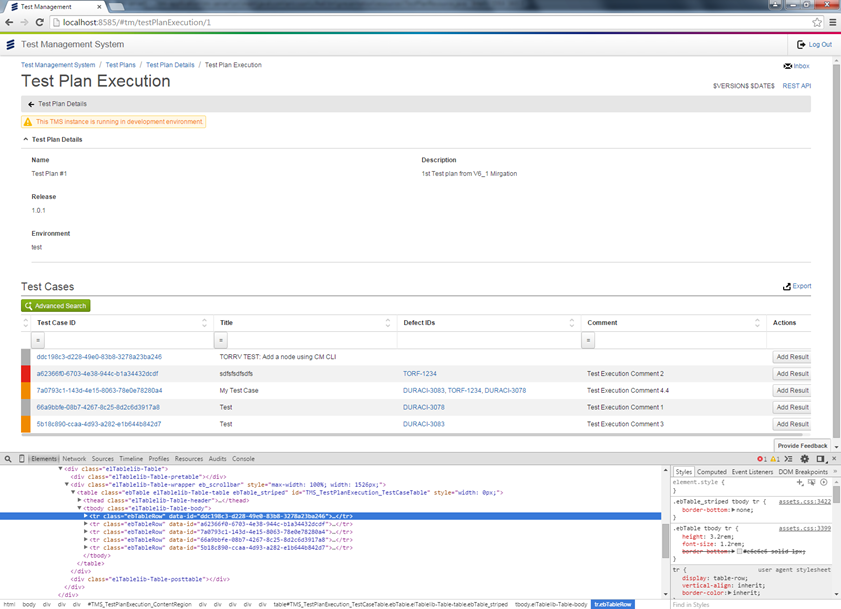
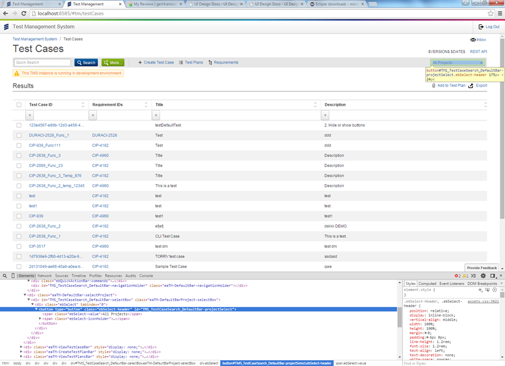

Title: Making UI testing easier
Slug: making-ui-testing-easier
Date: 2016-11-07 15:33
Category: TAF
Tags: ui testing
Authors: Gerald Glennon
Status: published
Summary: Simple steps to make UI testing easier.


####Introduction

This is an introduction into how to make life easier when writing UI Tests. The key points to writing good tests are:

    Using Id Tags
    Taking UI screen shots
    Waiting for UI components
    Modularity
    Parallel Execution

####Using Id Tags

The problems are: 
1) How to traverse a table to get row information in java easily. 
2) Being able to traverse table data and get the right field or table cell is a challenge in UI Testing
3) Finding specific dom elements easily and understanding where they are from reading a log file when it fails


The solution to this is to use Id tags to help you find those elements both from testing in java and from reading logs.

In java it takes a lot of code to search a table --> row --> cell etc. for the data you want and update. Not to mention slowing down the test to do so.

Why not have the row tell use a piece of information or unique Id so we can go straight to that row.  

When reading logs the Id tag should give the the user and idea where it is in the UI and not just by name because people can forget widget names. We discuss below on an example of conventions etc.
Id Tags on Tables

This is important for UI testing. Using HTM5 data-* attribute is a common convention that is being used with this new standard. This can be used for tables to give identifiers for each row of the table.

Using this standard it can allow us to find table rows very easily. In the image below it shows an example of this. Each table has a Test Case Id cell in the HTML table. But in the DOM, the table row has the data-id attribute

present. data-id = ddc198c3-d228-49e0-83b8-3278a23ba246



From here it is now easy to get the table row. Below is an example of code to get the row....and its only one line

This is an example of java code using the data-id attribute to get the table row that is needed
```java
    private UiComponent findTableRow(UiComponent table, String rowId) {
        return table.getDescendantsBySelector("[data-id=\"" + rowId + "\"]").get(0);
    }
```

Examples UI-SDK TABLE SDK UI
Creating a plugin module to allow plugin in UI-SDK TABLE UI

```json
    define([
        'jscore/core'
    ], function (core) {
        'use strict';
     
        var Plugin = function (options) {
            this.options = options || {};
            this.init.apply(this, arguments);
        };
     
        Plugin.prototype.init = function () {
        };
        Plugin.prototype.getOptions = function () {
            return this.options;
        };
     
        Plugin.prototype.getTable = function () {
            return this._table;
        };
        Plugin.prototype.injections = {
            before: {},
            after: {},
            newMethods: {}
        };
     
        Plugin.extend = core.extend;
     
        return Plugin;
     
    });
```

Creating the actual Plugin to create data-id tag in the table

```json
    define([
        '../Plugin',
        '../../../ObjectHelper'
    ], function (Plugin, ObjectHelper) {
        'use strict';
     
        return Plugin.extend({
            /*jshint validthis:true */
     
            injections: {
     
                after: {
                    addRow: addRow
                }
     
            }
     
        });
     
        function addRow (object, index) {
            var table = this.getTable(),
                rowIdentifier = index !== undefined ? index : table.getRows().length - 1,
                row = table.getRows()[rowIdentifier];
     
            if (this.options.rowIdentifier) {
                rowIdentifier = ObjectHelper.findValue(object, this.options.rowIdentifier);
            }
            row.getElement().setAttribute('data-id', rowIdentifier);
        }
     
    });
```


How to use the plugin once it has been created

```json
   this.table = new Table({
       tooltips: true,
       columns: this.columns,
       modifiers: [
           {name: 'striped'}
       ],
       plugins: [
               new IdentifiableRows({
                   rowIdentifier: options.tableRowAttribute || 'id'})
         ])
   });
```

Examples UI-SDK Old TABLE UI
Creating the actual Plugin to create data-id tag in the table

```json
   /*global define*/
   define([
       'widgets/Table'
   ], function (Table) {
       'use strict';
    
   return Table.extend({
           init: function (options, data) {
               Table.prototype.init.call(this, options, data);
               this.rowIdentifier = this.options.rowIdentifier;
           },
           addRow: function (data) {
               Table.prototype.addRow.call(this, data);
               var row = this._modelRowBindings[data.cid],
                   rowBody= row.view.getBody ? row.view.getBody() : row.getElement().find('tr');
    
    
               if (this.rowIdentifier != null) {
                   rowBody.setAttribute('data-id', row.getCells()[this.rowIdentifier].getValue());
               } else {
                   rowBody.setAttribute('data-id', this._rows.length - 1);
               }
           }
       });
   });
```


```json
   this.table = new Table({
       tooltips: true,
       columns: this.columns,
       modifiers: [
           {name: 'striped'}
       ],
          rowIdentifier: ‘testCaseId'
   });
```

Id Tags On elements
Id tags are only used for Testing purposes. Adding Id tags to elements allow us in UI testing to quickly select the item to manipulate for that Test.
It also helps when a test fails to quickly debug where that problem or element is without having to search for it.
If at all possible having an convention for how the Id tags are used is even better. Something that can tell what web page it is on and perhaps the element location or widget it is in.
What if Widgets are not unique and will be reused multiple times around the application. Unfortunately then you will need to stick with class identifiers and getting child element in Java code.
Below is an example of Id tag being used on a drop down box to identify it. the id tag reads TMS_TestCaseSearch_DefaultBar-ProjectSelect. Here is a convention by the team for this application
https://confluence-oss.seli.wh.rnd.internal.ericsson.com/display/TAF/Functional+Testing+Naming+Convention
A quick example of this Id tag TMS_TestCaseSearch_DefaultBar-ProjectSelect
TMS - Application Name
TestCaseSearch - The webpage where the element is present
DefaultBar-ProjectSelect - The widget name and identifier



Example of setting Id's

Unfortunately to do this requires either specifying this in the HTML or on code level in java script etc.

JAVASCRIPT
```json
   this.selectBox.view.getButton().setAttribute('id', 'TMS_TestCaseSearch_DefaultBar-projectSelect');
```

HTML
```html
   <button id="TMS_TestCasesSearch_addButton" class="ebBtn eaTM-TestCasesSearch-addButton">
```

####Taking UI screen shots

When their are a large amount of Test Case running in Jenkins or on the grid and one test case fails. How can the problem be understood apart from the logs or in some cases the logs are not enough
to understand why the test case failed.

The solution is always to take a screen shot if an element is not visible on screen or the test fails trying to access an element. Viewing an image of the problem rather than reading log information on the element is much faster
for the developer to understand the problem. Whether the element is present on screen or the page fails to load.


####Waiting For UI components
Why wait for components? In most website design all requests are asynchronous meaning they will run and finish at different times. Never use sleep functions/methods as they will be forgotten about over time and slow your test down.
If I was to set a sleep function of 5 seconds. and it passed locally. This is great and now I'll put on selenium grid and use it for acceptance testing on a physical machine. It then fails, why it fails is that selenium grid and go as fast or as slow as it needs. The network can go as fast and as slow as it needs.
the timeout is 5 seconds and it can take more or less than 5 seconds. So each run the test can pass or fail. Ok so lets put a big timeout. Now the problem is your waisting time that may not be needed and hence the test is slower.

This is why we use wait conditions to wait for the element to appear/hide and when it does continue with the test.
When testing its its not feasible to wait indefinitely for an icon to appear or any other element on screen. The key point is if there was no timeouts then your test would hang forever if the element. UI tests are designed with performance in mind. When waiting for a component a max timeout should be specified.
If the timeout runs out it maybe a case that the UI was slow or the test itself along with network delays has caused the timeout to run over.


####Modularity

Writing UI tests can take a long time to write with each one being unique if written poorly.

To solve this split methods that correspond to certain areas of the screen or even an entire pages. For example a method to finding a row of data in a table or doing a search on a page.
The benefits of this to a developer is that when writing their tests they can re-use other methods and add new ones for their test. Hence reducing the time it takes to write a UI Test.

####Parallel Execution

Running UI Tests sequentially will take a long time. Especially if the applications is a big project. Meaning when code is added UI tests could take an hour or 2 ...even more.
Even for a small change.

Use parallel execution to run your tests side by side. The gotcha for this however is that the UI Tests must be atomic and not interfere with each other. Otherwise you will have failing test cases.

This will reduce time waiting for UI Tests to complete by a factor of how many execution is ran at one time. For an ever expanding project with more and more UI Tests added the time for running these tests can grow also.

So having the ability to simply increase the execution rate from 6 parallel execution to 10 or more will greatly reduce times back to a wanted level.

####Conclusion

The conclusion is that writing UI Test can be time consuming and frustrating to maintain. So by carefully writing and structuring of these tests the pain of maintain these tests can be reduced.

It is not possible to fully remove maintenance of  UI tests altogether but keeping these test as stable tests and making them robust enough not to break is very important.

It is also important that when the break it can be detected quickly where the problem is and provide good information to the developer on the issue that has occurred.

Email: gerald.glennon@ericsson.com
