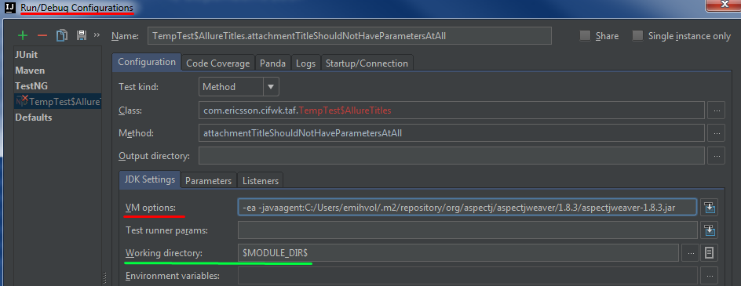

Title: Enabling Allure Aspects
Slug: enabling-allure-aspects
Date: 2017-02-22 18:23
Category: TAF
Tags: Allure, TAF, AOP
Authors: Mihails Volkovs
Status: published
Summary: After reading this blog post you will be able to troubleshoot disappeared attachments and test steps in your Allure report from tests executed locally in your IDE.


[TOC]

Imagine that you run a test locally from your IDE. Allure XML report gets generated. However some attachments are missing. Test steps are not in the report as well. Most probably the reason of that all is switched off Allure aspects. Let's troubleshoot it step by step.

# Assumptions

 - you are using the TAF version of Allure (you can easily check that by reviewing the annotations in your tests - should be ``@com.ericsson.cifwk.taf.annotations.TestId``, not ``@ru.yandex.qatools.allure.annotations.TestCaseId``),
 - annotated method is get called (please make sure the issue is not in your test logics),
 - test thread is not "killed" externally (if you don't manage threads yourself, you can just ignore this point).

# Troubleshooting missing attachments or test steps

### Problem description

 - you have the methods annotated with ``@com.ericsson.cifwk.taf.annotations.Attachment`` and ``@com.ericsson.cifwk.taf.annotations.TestStep``,
 - you call these methods from your test,
 - you run your test from your IDE,
 - neither test steps nor attachments appear in the Allure report (it should be visible in XML report, HTML report generation is not required for this check).

### Root cause

 - the Allure aspects haven't been turned on
 
# Solution

Please make sure that:

 - the ``.xml`` file has been generated (usually ``target/allure-results`` folder in the test execution folder),
 - sure the method annotated as ``@Attachment`` does return non-empty content and that the ``@TestStep`` method is called,
 - the annotated methods are located in classes in package ``com.ericsson`` or in subpackages (for performance issues aspects are applied only to those classes by default),
 - you have the *Java Agent* defined in *Maven Surefire Plugin* in your ``pom.xml``:
 
```xml
<build>
    <plugins>
        <plugin>
            <groupId>org.apache.maven.plugins</groupId>
            <artifactId>maven-surefire-plugin</artifactId>
            <configuration>
                <argLine>-javaagent:${settings.localRepository}/org/aspectj/aspectjweaver/1.8.3/aspectjweaver-1.8.3.jar</argLine>
            </configuration>
        </plugin>
    </plugins>
</build>
```

 - you have the corresponding version of ``aspectjweaver`` library in your local maven repository, or add following dependency for the library to be fetched:

```xml
<dependency>
    <groupId>org.aspectj</groupId>
    <artifactId>aspectjweaver</artifactId>
    <version>1.8.3</version>
</dependency>
```

 - the library mentioned above is in a class path for your test.

### IntelliJ IDEA
IntelliJ IDEA is smart enough to read the *Maven Surefire Plugin* configuration and to add the corresponding VM arguments for every test executed in the same module.

### Eclipse, NetBeans and others
For other IDE users (or if you don't have the *Maven Surefire Plugin*, or don't have *Maven*) you can add the corresponding VM argument manually to test the execution configuration. Here is an example of VM Options:

```
-ea -javaagent:C:/Users/emihvol/.m2/repository/org/aspectj/aspectjweaver/1.8.3/aspectjweaver-1.8.3.jar
```



