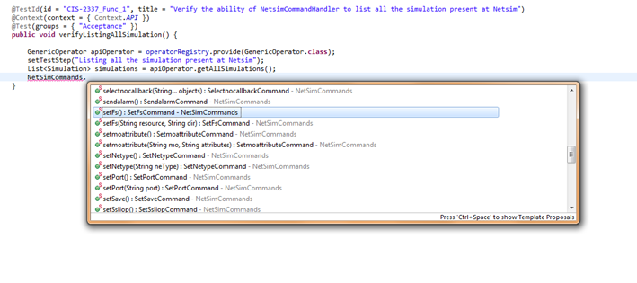

<head>
   <title>NetSim Command Handler</title>
</head>

# NetSim Command Handler

## What is NetSim?

NetSim is software used in PDU OSS to simulate network nodes and traffic.

## What is the TAF NetSim Command Handler?

The <span style="color:#ba3925;">NetSimCommandHandler</span> is used to communicate with NetSim instances and both manage and run commands on simulations and network elements.

## How to get started

**<span style="color:#ba3925;">1. Create an instance of the appropriate NetSim handler</span>**

<span style="color:#ba3925;">NetSimCommandHandler</span> is a class that provides three ways of work with NetSim:

* <span style="color:#ba3925;">NetSimCommandHandler.getInstance(Host… hosts)</span> returns an instance of <span style="color:#ba3925;">NetSimCommandHandler</span> that works with
  the provided set of <span style="color:#ba3925;">Host's</span>. All methods that <span style="color:#ba3925;">NetSimCommandHandler</span> instance provides will return the results for all
  hosts defined at the instantiation time. You can pass the list of hosts as an array, or just a comma-separated list of entities.

* <span style="color:#ba3925;">NetSimCommandHandler.getContext(Host host)</span> returns an instance of <span style="color:#ba3925;">NetSimContext</span> that works with the
  particular host. <span style="color:#ba3925;">NetSimContext</span> is a "stateless" interface that allows you to execute a batch of the NetSim commands on the defined host.

* <span style="color:#ba3925;">NetSimCommandHandler.getSession(Host host)</span> returns an instance of <span style="color:#ba3925;">NetSimSession</span> that works with the
  particular host. <span style="color:#ba3925;">NetSimSession</span> is a "stateful" interface that allows you to execute a batch of the NetSim commands on the defined host.
  As opposed to <span style="color:#ba3925;">NetSimContext, NetSimSession</span> remembers your command history.

**<span style="color:#ba3925;">2. Create the instances of the commands you need to execute in NetSim</span>**

In the legacy <span style="color:#ba3925;">NetsimHandler (com.ericsson.cifwk.taf.handlers.netsim.NetsimHandler)</span>  you passed the commands in plain text and got a plain text response.
In <span style="color:#ba3925;">NetSimCommandHandler</span>  you deal with the concrete classes - implementations of <span style="color:#ba3925;">com.ericsson.cifwk.taf.handlers.netsim.NetSimCommand</span>.
For example, you can use <span style="color:#ba3925;">OpenCommand</span>  instance to open a simulation, <span style="color:#ba3925;">ShowSimnesCommand</span>  to output the list of NEs that belong to
this simulation - and so on.

Almost all the commands require parameters. If you don’t populate the mandatory parameters, your command will not work correctly. To set them you have to create an instance of the command class,
and then call appropriate setter methods. You cannot do this directly - there’s a factory class <span style="color:#ba3925;">com.ericsson.cifwk.taf.handlers.netsim.commands.NetSimCommands</span> that
creates the instances of the commands. Also, it takes away the pain of creating excessive code that call setters.

For example, there are two alternatives of creating an instance of <span style="color:#ba3925;">SetFsCommand</span>:

```java
    SetFsCommand setFsCmd = NetSimCommands.setFs();
    setFsCmd.setDir("/home/mydir");
    setFsCmd.setResource("resource");
```

and

```java
    SetFsCommand setFsCmd = NetSimCommands.setFs("resource", "/home/mydir");
```

Which is 2 lines of code shorter. This initialization shortcut is currently only available for commands that have up to 5 arguments.
Commands with 5 or more arguments must use the standard initialization method (example 1).

:------- | :--------
**NOTE** | If you cannot find the command you need among the provided ones, get in touch with TAF development team, and we will implement it for you ASAP.

**<span style="color:#ba3925;">3. Execute the commands</span>**

Use instance of <span style="color:#ba3925;">NetSimCommandHandler, NetSimContext</span> or <span style="color:#ba3925;">NetSimSession</span> to execute your commands:

```java
    NetSimCommandHandler handler = NetSimCommandHandler.getInstance(host1, host2, host3);
    // Results mapped to appropriate NetSim host contexts
    Map<NetSimContext, NetSimResult> results = handler.exec(NetSimCommands.showSimulations(),
    NetSimCommands.showStarted());

    NetSimContext context = NetSimCommandHandler.getContext(host4);
    NetSimResult contextResult = context.exec(NetSimCommands.showSimulations(),
    NetSimCommands.showStarted());

    NetSimSession session = NetSimCommandHandler.getSession(host5);
    NetSimResult sessionResult = session.exec(NetSimCommands.showSimulations(),
    NetSimCommands.showStarted());
```java

If you execute the list of commands, they are executed one by one in the sequence you defined.

That’s it! Please read further to get more details on the NetSim command handler API.


## Support for Multiple Netsim V-Farms/Hosts

Netsim Network elements can now be distributed across multiple V-Farms. It is therefore necessary to return a List containing all Hosts of type Netsim, when searching
for an Network Element using the DataHandler, as this element may be located on any one of the available Netsim Hosts.

```
/* Prior to multiple netsim v-Farms being introduced, it was possible to return a single Host of type Netsim as all Network Elements were guaranteed to be contained on this single Host. */
Host host = DataHandler.getHostByType(HostType.NETSIM);

/* Now Network Elements may be distributed across multiple hosts. Therefore, it is necessary to get all the Netsim Hosts available */
List<Host> hosts = DataHandler.getAllHostsByType(HostType.NETSIM);

/* No other changes are required, as the getInstance method in NetsimCommandHandler is overloaded and can accept one or many Host objects passed as an argument. */
public static NetSimCommandHandler getInstance(Host... hosts) { ... }
public static NetSimCommandHandler getInstance(List<Host> hosts) { ... }
```


## Anatomy of NetSimResult

<span style="color:#ba3925;">NetSimResult</span> contains the result of NetSim commands execution. Whatever NetSim command handler class you use (<span style="color:#ba3925;">NetSimCommandHandler, NetSimContext, NetSimSession</span>), you
get <span style="color:#ba3925;">NetSimResult</span> as a result of command execution. It has the following methods to retrieve the real output:

* <span style="color:#ba3925;">CommandOutput[] getOutput()</span> returns an array of <span style="color:#ba3925;">CommandOutput</span> objects - one object per executed command (in appropriate sequence).

* <span style="color:#ba3925;">String getRawOutput()</span> returns the results of execution as they were returned by NetSim, unparsed.

:------- | :--------
**NOTE** | <span style="color:#ba3925;">getRawOutput()</span> returns the results of all the commands that were executed. In case you execute the commands using <span style="color:#ba3925;">NetSimSession, Simulation, NetworkElement, NeGroup, SimulationGroup,</span> this text will contain additional command output. So it’s really good only for debug purposes.

<span style="color:#ba3925;">CommandOutput</span> has the following methods:

* <span style="color:#ba3925;">String getRawOutput()</span> - returns the text result for the command

* <span style="color:#ba3925;">List&lt;String&gt; asList()</span> - returns the text output, split into rows

* <span style="color:#ba3925;">Map&lt;String, List&lt;String&gt;&gt; asRows()</span> - returns the text output, split into rows, which are mapped to the headings. First
  column is assumed to be the headings, so it’s not returned here as part of the list. All following content of the row is treated as set of columns (if text is
  separated by 2 or more whitespaces, it’s treated as 2 separate columns).

* <span style="color:#ba3925;">List&lt;Map&lt;String,String&gt;&gt; asColumns()</span> - returns the text output, split into columns. First row in output is assumed to be the headings,
  and it’s not returned here as part of the list. All following rows are returned as this List of Maps - every Map represents one row, where column data is mapped to
  column name. Use it to get the contents of the table.

* <span style="color:#ba3925;">Map&lt;String, List&lt;Map&lt;String, String&gt;&gt;&gt; asSections()</span> - returns the text output, split into sections. Section is a set of homogeneous
  tables under a caption. Section heading is the caption (key in the result Map), and the appropriate table data is mapped to it in the same structure that is returned
  by <span style="color:#ba3925;">asColumns()</span> for a single table.

### Example: asRows()
Raw text output, returned by a NetSim command:

```
    >> .mycommand
    fs  /netsim/netsim_dbdir/simdir/netsim/netsimdir/LTED1180-V2x10-FT-FDD-LTE01/LTE01ERBS00001/fs
    tmpfs     off one   two three
```

<span style="color:#ba3925;">asRows()</span> will return a Map with 2 entries that have "fs" and "tmpfs" keys respectively; first entry contains a List with 1
record, second entry contains a List with 2 records ("off one" and "two three").

### Example: asColumns()
Text output, returned by a NetSim command:

```
    NE Name                  Type              Server         In Address       Default dest.
    LTE01ERBS00001           LTE ERBS D1180-V2 netsim         192.168.100.2
    LTE01ERBS00002           LTE ERBS D1180-V2 netsim         192.168.100.3
    LTE01ERBS00003           LTE ERBS D1180-V2 netsim         192.168.100.4
    LTE01ERBS00004           LTE ERBS D1180-V2 netsim         192.168.100.5
    LTE01ERBS00005           LTE ERBS D1180-V2 netsim         192.168.100.6
    LTE01ERBS00006           LTE ERBS D1180-V2 netsim         192.168.100.7
    LTE01ERBS00007           LTE ERBS D1180-V2 netsim         192.168.100.8
    LTE01ERBS00008           LTE ERBS D1180-V2 netsim         192.168.100.9
    LTE01ERBS00009           LTE ERBS D1180-V2 netsim         192.168.100.10
    LTE01ERBS00010           LTE ERBS D1180-V2 netsim         192.168.100.11
```

<span style="color:#ba3925;">asColumns()</span> will return a List with 10 rows (10 Maps), where each column value is mapped to the name of the column. So first
row would contain mappings {NE Name=LTE01ERBS00001, Type=LTE ERBS D1180-V2, ….}

### Example: asSections() example
Text output, returned by a NetSim command:

```
    'server_00016_LTE_ERBS_D125-V2@netsim' for LTE ERBS D125-V2
    =================================================================
        NE                       Address          Simulation/Commands
        LTE02ERBS00081           192.168.100.96   /netsim/netsimdir/LTED125-V2x160-ST-FDD-LTE02
        LTE02ERBS00097           192.168.100.112  /netsim/netsimdir/LTED125-V2x160-ST-FDD-LTE02
        LTE02ERBS00128           192.168.100.143  /netsim/netsimdir/LTED125-V2x160-ST-FDD-LTE02
        LTE02ERBS00158           192.168.100.173  /netsim/netsimdir/LTED125-V2x160-ST-FDD-LTE02
        LTE02ERBS00020           192.168.100.35   /netsim/netsimdir/LTED125-V2x160-ST-FDD-LTE02
        LTE02ERBS00104           192.168.100.119  /netsim/netsimdir/LTED125-V2x160-ST-FDD-LTE02
        LTE02ERBS00040           192.168.100.55   /netsim/netsimdir/LTED125-V2x160-ST-FDD-LTE02
        LTE02ERBS00062           192.168.100.77   /netsim/netsimdir/LTED125-V2x160-ST-FDD-LTE02
        LTE02ERBS00155           192.168.100.170  /netsim/netsimdir/LTED125-V2x160-ST-FDD-LTE02
        LTE02ERBS00133           192.168.100.148  /netsim/netsimdir/LTED125-V2x160-ST-FDD-LTE02
        LTE02ERBS00067           192.168.100.82   /netsim/netsimdir/LTED125-V2x160-ST-FDD-LTE02
        LTE02ERBS00064           192.168.100.79   /netsim/netsimdir/LTED125-V2x160-ST-FDD-LTE02
        LTE02ERBS00149           192.168.100.164  /netsim/netsimdir/LTED125-V2x160-ST-FDD-LTE02
        LTE02ERBS00055           192.168.100.70   /netsim/netsimdir/LTED125-V2x160-ST-FDD-LTE02
        LTE02ERBS00027           192.168.100.42   /netsim/netsimdir/LTED125-V2x160-ST-FDD-LTE02
        LTE02ERBS00154           192.168.100.169  /netsim/netsimdir/LTED125-V2x160-ST-FDD-LTE02
        LTE02ERBS00049           192.168.100.64   /netsim/netsimdir/LTED125-V2x160-ST-FDD-LTE02
        LTE02ERBS00122           192.168.100.137  /netsim/netsimdir/LTED125-V2x160-ST-FDD-LTE02
        LTE02ERBS00031           192.168.100.46   /netsim/netsimdir/LTED125-V2x160-ST-FDD-LTE02
        LTE02ERBS00041           192.168.100.56   /netsim/netsimdir/LTED125-V2x160-ST-FDD-LTE02
        LTE02ERBS00007           192.168.100.22   /netsim/netsimdir/LTED125-V2x160-ST-FDD-LTE02
        LTE02ERBS00140           192.168.100.155  /netsim/netsimdir/LTED125-V2x160-ST-FDD-LTE02
        LTE02ERBS00004           192.168.100.19   /netsim/netsimdir/LTED125-V2x160-ST-FDD-LTE02
        LTE02ERBS00003           192.168.100.18   /netsim/netsimdir/LTED125-V2x160-ST-FDD-LTE02
        LTE02ERBS00002           192.168.100.17   /netsim/netsimdir/LTED125-V2x160-ST-FDD-LTE02
        LTE02ERBS00001           192.168.100.16   /netsim/netsimdir/LTED125-V2x160-ST-FDD-LTE02

    'server_00015_LTE_ERBS_D1180-V2@netsim' for LTE ERBS D1180-V2
    =================================================================
        NE                       Address          Simulation/Commands
        LTE01ERBS00004           192.168.100.5    /netsim/netsimdir/LTED1180-V2x10-FT-FDD-LTE01
        LTE01ERBS00010           192.168.100.11   /netsim/netsimdir/LTED1180-V2x10-FT-FDD-LTE01
        LTE01ERBS00003           192.168.100.4    /netsim/netsimdir/LTED1180-V2x10-FT-FDD-LTE01
        LTE01ERBS00007           192.168.100.8    /netsim/netsimdir/LTED1180-V2x10-FT-FDD-LTE01
        LTE01ERBS00008           192.168.100.9    /netsim/netsimdir/LTED1180-V2x10-FT-FDD-LTE01
        LTE01ERBS00001           192.168.100.2    /netsim/netsimdir/LTED1180-V2x10-FT-FDD-LTE01
    END
```

<span style="color:#ba3925;">asSections()</span> would return a Map with 2 entries, where each entry key is a section heading <span style="color:#ba3925;">(server_00016_LTE_ERBS_D125-V2@netsim for LTE ERBS D125-V2</span>
and <span style="color:#ba3925;">server_00015_LTE_ERBS_D1180-V2@netsim for LTE ERBS D1180-V2)</span>, and entry value is a List of appropriate table data (26 and 6 records).

## NetSimCommandHandler

<span style="color:#ba3925;">NetSimCommandHandler</span> allows you to run a set of the commands on different hosts, but it also provides a possibility to run sets of some predefined commands. The functionality available is:

* <span style="color:#ba3925;">NeGroup getAllNEs()</span> - returns a group of all network elements in all simulations on all hosts set for this <span style="color:#ba3925;">NetSimCommandHandler</span> instance. Please note that NEs with the same name from different simulations and/or hosts will be treated as different entities (equals() will return false).

* <span style="color:#ba3925;">NeGroup getSimulationNEs(String… simNames)</span> - returns a group of network elements that belong to the provided set of simulations.

* <span style="color:#ba3925;">SimulationGroup getAllSimulations()</span> - returns a group of simulations on all hosts set for this <span style="color:#ba3925;">NetSimCommandHandler</span> instance.

* <span style="color:#ba3925;">SimulationGroup getSimulations(String… simNames)</span> - returns a group of simulations, identified by the provided names. If Host1 contains simulations A and B, and Host2 contains simulations B and D, <span style="color:#ba3925;">getSimulations("A","B","C")</span> will return a group containing A,B(Host1),B(Host2) simulations.

* <span style="color:#ba3925;">boolean isStarted(String neName)</span> - returns <span style="color:#ba3925;">true</span> if a network element with provided name is started on any host set for this NetSimCommandHandler instance.

* <span style="color:#ba3925;">Map&ly;NetsimContext, NetsimResult&gt; exec(NetsimCommand… commands)</span> - executes the provided set of commands, and returns a mapping of the context (created for appropriate host - note that <span style="color:#ba3925;">NetSimContext.getHostName()</span> returns the host name, equal to the value returned by <span style="color:#ba3925;">Host.toString()</span>) to the appropriate result.

### How to initialize

Call <span style="color:#ba3925;">NetSimCommandHandler.getInstance(Host… hosts)</span> to get an instance of <span style="color:#ba3925;">NetSimCommandHandler</span> that works with the provided set of Host's.
You can pass the list of hosts as an array, or just a comma-separated list of entities.

### How should I close the resources after test?

You don’t have to worry about that: all NetSimContexts, opened in tests, are automatically closed after the tests are finished. This is handled by <span style="color:#ba3925;">NetSimTestListener</span>. However, you
can use <span style="color:#ba3925;">NetSimCommandHandler.setContextClosePolicy (TestExecutionEvent eventType)</span> to override the default functionality, calling it in the test method, annotated with @BeforeSuite annotation.

Resources can be closed in the following cases:

```
    ON_TEST_FINISH          each time a test finishes
    ON_SUITE_FINISH         after the SuiteRunner has run the test suite
    ON_EXECUTION_FINISH     on completion of execution
```

**Example:**

```java
    @BeforeSuite
    public void beforeSuite() {
        NetSimCommandHandler.setContextClosePolicy(TestExecutionEvent.ON_EXECUTION_FINISH);
    }
```

:------- | :--------
**NOTE** | The default behaviour in-built in TAF is to close the resources when the tests in the suite have been executed.

## NetSimContext

<span style="color:#ba3925;">NetSimContext</span> is a stateless command execution facility that works with the particular host. Some of the provided methods are:

* <span style="color:#ba3925;">NetSimResult exec(NetSimCommand… commands)</span> - execute the commands

* <span style="color:#ba3925;">boolean isNetSimRunning()</span> - returns true if NetSim is running on the current host

* <span style="color:#ba3925;">openNetSimSession()</span> - returns a NetSim session instance that will execute the commands on the current host

* <span style="color:#ba3925;">String getHostName()</span> - returns the name of the current host

* <span style="color:#ba3925;">void close()</span> - closes the context and its sessions

* <span style="color:#ba3925;">boolean isClosed()</span> - checks if context is closed

### How to initialize

Call <span style="color:#ba3925;">NetSimCommandHandler.getContext(Host host)</span>.

## NetSimSession

<span style="color:#ba3925;">NetSimSession</span> is a stateful command execution facility that works with the particular host. Some of the provided methods are:

* <span style="color:#ba3925;">NetSimResult exec(NetSimCommand… commands)</span> - execute the commands

* <span style="color:#ba3925;">void close()</span> - closes the session

* <span style="color:#ba3925;">boolean isClosed()</span> - checks if session is closed

## NetSimSession VS NetSimContext

As opposed to <span style="color:#ba3925;">NetSimContext, NetSimSession</span> remembers your command history. It works the same way as <span style="color:#ba3925;">netsim_shell</span>
binary (which, in fact, is used behind the scene here). For example - you can execute the following set of commands in <span style="color:#ba3925;">NetSimSession</span>:

```java
    NetSimSession session = NetSimCommandHandler.getSession(host5);
    session.exec(NetSimCommands.open("simulation1"), NetSimCommands.selectnocallback("ne1",
    "ne2"), NetSimCommands.stop());
    ....
    session.exec(NetSimCommands.selectnocallback("ne3"), NetSimCommands.start());
```

The seconds batch will work because NetSimSession remembers that you opened the simulation "simulation1". If you would use NetSimContext, you would have to open
it again and again if you work with the object from the same simulation.

That’s how you would do it with <span style="color:#ba3925;">NetSimContext</span>:

```java
    NetSimContext context = NetSimCommandHandler.getContext(host5);
    // Alternative 1:
    context.exec(NetSimCommands.open("simulation1"), NetSimCommands.selectnocallback("ne1",
    "ne2"), NetSimCommands.stop(), NetSimCommands.selectnocallback("ne3"), NetSimCommands.start());
    // Alternative 2:
    context.exec(NetSimCommands.open("simulation1"), NetSimCommands.selectnocallback("ne1",
    "ne2"), NetSimCommands.stop());
    context.exec(NetSimCommands.open("simulation1"), NetSimCommands.selectnocallback("ne3"),
    NetSimCommands.start());
```

<span style="color:#ba3925;">NetSimSession</span> performs much faster than <span style="color:#ba3925;">NetSimContext</span> when used with elements that belong to a small amount of simulations.

### How to initialize

Call <span style="color:#ba3925;">NetSimCommandHandler.getSession(Host host)</span> or <span style="color:#ba3925;">NetSimContext.openSession()</span>.

### How to set timeout

Timeout could be set for both <span style="color:#ba3925;">NetSimSession</span> and <span style="color:#ba3925;">NetSimContext</span> by adding <tt>taf.netsim.command.timeout</tt> property or passing it as a parameter <tt>-Dtaf.netsim.command.timeout</tt>

## Simulation

<span style="color:#ba3925;">Simulation</span> is a representation of NetSim simulation. Some of the provided methods are:

* <span style="color:#ba3925;">NetworkElement getNetworkElement(String neName)</span> - returns this simulation’s NE found by name, or null if it wasn’t found

* <span style="color:#ba3925;">String getName()</span> - returns all network elements that belong to this simulation

* <span style="color:#ba3925;">List&lt;NetworkElement&gt; getAllNEs()</span> - returns all network elements that belong to this simulation

* <span style="color:#ba3925;">List&lt;NetworkElement&gt; getStartedNEs()</span> - returns all started network elements that belong to this simulation

* <span style="color:#ba3925;">NetSimContext getContext()</span> - returns the context (that represents an appropriate Host) that this simulation belongs to

* <span style="color:#ba3925;">NetSimResult exec(NetSimCommand… commands)</span> - executes the provided commands in the context of this simulation. So, to select a NE, you just have to run <span style="color:#ba3925;">exec(NetSimCommands.selectnocallback("ne1")))</span>.

### How to initialize

Get the simulations from <span style="color:#ba3925;">SimulationGroup</span> or <span style="color:#ba3925;">NetSimCommandHandler</span>

## NetworkElement

<span style="color:#ba3925;">NetworkElement</span> is a representation of NetSim Network element. It has all the attributes available via getters (check out the Javadoc). Some of the provided methods are:

* <span style="color:#ba3925;">String getSimulationName()</span> - returns the name of NE’s simulation

* <span style="color:#ba3925;">Simulation getSimulation()</span> - returns the NE’s simulation as an object

* <span style="color:#ba3925;">boolean start()</span> - attempts to start this NE, and returns true on success

* <span style="color:#ba3925;">boolean stop()</span> - attempts to stop this NE, and returns true on success

* <span style="color:#ba3925;">NetSimResult exec(NetSimCommand… commands)</span> - executes the provided commands in the context of this NE. So, to stop this element, you just have to run <span style="color:#ba3925;">exec(NetSimCommands.stop())</span>.

### How to initialize

Call <span style="color:#ba3925;">Get the NetworkElement from NetSimCommandHandler, the simulation or initialize it yourself</span>.

## NeGroup

<span style="color:#ba3925;">NeGroup</span> is a group of network elements, a facility to run the set of the same commands against a group of particular network elements. Some of the provided methods are:

* <span style="color:#ba3925;">Map&lt;NetworkElement, NetSimResult&gt; exec(NetSimCommand… NetsimCommands)</span> - executes the provided commands for all the group members, and returns a Map where the result is mapped to appropriate element.

* <span style="color:#ba3925;">NetworkElement get(String neName)</span> - returns a NE found by name, or null if it wasn’t found.

* <span style="color:#ba3925;">Map&lt;String, NetworkElement&gt; getNEMap()</span> - returns the group members, mapped to their names

* <span style="color:#ba3925;">List&lt;NetworkElement&gt; getNetworkElements()</span> - returns the list of group members

Also, since TAF 2.0.9 version <span style="color:#ba3925;">NeGroup</span> implements <span style="color:#ba3925;">java.util.Collection</span> interface, therefore, it supports all the operations that usual Java collection (List in this case) does.

### How to initialize

Get the <span style="color:#ba3925;">NeGroup</span> from <span style="color:#ba3925;">NetSimCommandHandler</span> or initialize it yourself - then all you need is a collection of <span style="color:#ba3925;">NetworkElement's</span>.

## SimulationGroup

<span style="color:#ba3925;">SimulationGroup</span> is a group of simulations, a facility to run the set of the same commands against a group of particular NetSim simulations. Some of the provided methods are:

* <span style="color:#ba3925;">Map&lt;Simulation, NetSimResult&gt; exec(NetSimCommand… commands)</span> - executes the provided commands for all the group members, and returns a Map where the result is mapped to appropriate element.

* <span style="color:#ba3925;">Simulation get(String simName)</span> - returns a simulation found by name, or null if it wasn’t found.

* <span style="color:#ba3925;">Map&lt;String, Simulation%gt; getSimulationsMap()</span> - returns the group members, mapped to their names

* <span style="color:#ba3925;">List&lt;Simulation&gt; getSimulations()</span> - returns the list of group members

Also, since TAF 2.0.9 version <span style="color:#ba3925;">SimulationGroup</span> implements <span style="color:#ba3925;">java.util.Collection interface</span>, therefore, it supports all the operations that usual Java collection (List in this case) does.

### How to initialize

Get the <span style="color:#ba3925;">SimulationGroup</span> from <span style="color:#ba3925;">NetSimCommandHandler</span> or initialize it yourself - then all you need is a collection of <span style="color:#ba3925;">Simulation's</span>.

## How to view all available commands

A list of commands can be found by navigating to the data.tdd file: taf/taf-netsim/src/main/resources/fmpp/src/data/data.tdd


```
    A list of available NetSim commmands can also be viewed by using the autocomplete function provided
    by your IDE.
    Type NetSimCommands. (Including the full stop)
```



## NetSimCommandHandler Examples

### <span style="color:#ba3925;">Example 1: Checking the amount of NEs in simulations</span>

```java
    NetSimCommandHandler service = NetSimCommandHandler.getInstance(DataHandler.getHostByName("CI-
    Netsim"));
    SimulationGroup sims = service.getSimulations("LTED1180-V2x10-FT-FDD-LTE01",
    "LTED125-V2x160-ST-FDD-LTE02", "idontexist", "default");
    Map<String, Simulation> simulations = sims.getSimulationsMap();

    Simulation sim = simulations.get("LTED1180-V2x10-FT-FDD-LTE01");
    Assert.assertEquals(10, sim.getAllNEs().size());

    sim = simulations.get("LTED125-V2x160-ST-FDD-LTE02");
    Assert.assertEquals(160, sim.getAllNEs().size());

    sim = simulations.get("default");
    Assert.assertEquals(0, sim.getAllNEs().size());
```

### <span style="color:#ba3925;">Example 2: Execute a command on an NE</span>

```java
    NetSimCommandHandler service = NetSimCommandHandler.getInstance(host);
    NeGroup neGroup = service.getSimulationNEs("LTEC172-FT-LTE01");
    NetworkElement ne = neGroup.get("LTE01ERBS00001");

    StartCommand startCommand = NetSimCommands.start();
    StopCommand stopCommand = NetSimCommands.stop();

    NetSimResult startOutPut = ne.exec(startCommand);
    NetSimResult stopOutPut = ne.exec(stopCommand);
```

### <span style="color:#ba3925;">Example 3: Execute a command on an NEGroup</span>

```java
    NetSimCommandHandler service = NetSimCommandHandler.getInstance(host);
    NeGroup neGroup = service.getSimulationNEs("LTEC172-FT-LTE01");

    StartCommand startCommand = NetSimCommands.start();
    ShowFsCommand showFsCommand = NetSimCommands.showFs();

    Map <NetworkElement, NetSimResult> results = neGroup.exec(startCommand, showFsCommand);
```

### <span style="color:#ba3925;">Example 4: Execute the commands on two hosts for all NEs that belong to particular simulations</span>

```java
    NetSimCommandHandler service = NetSimCommandHandler.getInstance(DataHandler.getHostByName("CI-
    Netsim"), DataHandler.getHostByName("CI-Netsim2"));
    NeGroup simulationNEs = service.getSimulationNEs("sim1", "sim2);
    Map<NetworkElement, NetSimResult> result = nes.exec(NetSimCommands.showFs());
```

### <span style="color:#ba3925;">Example 5: Selecting only those NEs that are mounted to a particular location</span>

```java
    NetSimCommandHandler service = NetSimCommandHandler.getInstance(myHost);
    NeGroup nes = service.getSimulationNEs(simNames);
    // Get the FS data for all NEs
    Map<NetworkElement, NetSimResult> resultMap = nes.exec(NetSimCommands.showFs());
    Iterable<Entry<NetworkElement, NetSimResult>> properlyMounted = Iterables.filter(
    resultMap.entrySet(), new Predicate<Entry<NetworkElement, NetSimResult>>() {
             public boolean apply(Entry<NetworkElement, NetSimResult> arg) {
                    CommandOutput fsOutput = arg.getValue().getOutput()[0];
                    Map<String, List<String>> rows = fsOutput.asRows();
                    List<String> fsMount = rows.get("fs");
                    return StringUtils.contains(fsMount.get(0), "/netsim/netsim_dbdir/simdir/
                    netsim/");
             }
    });

    List<NetworkElement> properNEs = Lists.newArrayList();
    for (Entry<NetworkElement, NetSimResult> entry : properlyMounted) {
            properNEs.add(entry.getKey());
    }
```

## API Documentation

[NetSim API Documentation](https://taf.seli.wh.rnd.internal.ericsson.com/apidocs/Latest/com/ericsson/cifwk/taf/handlers/netsim/package-summary.html)

## How to add new Netsim Commands to TAF

**Problem:**

You want to use the TAF Netsim Command Handler but the particular command you want to run isn’t available.

**TAF Netsim Commands Implementation:**

In TAF all netsim commands are stored in a json file. When TAF is released this file is parsed and all json objects in it are converted into java methods.
These java methods act as netsim commands when called.

<span style="color:#ba3925;">Steps to add a new netsim command:</span>

1. Clone our git repo
    a. git clone ssh://<ericsson_id>@gerrit.ericsson.se:29418/OSS/com.ericsson.cifwk/ERICtaf_util
2. Update the netsim commands json file
    a. The location of the file to be edited can be found from root of project at: taf/taf-netsim/src/main/resources/fmpp/src/data/data.tdd
    b. Add your netsim command as a new json object in this file.

The following code snippet, added to the data.tdd file, would add the ".show component" NetSim command

```
    {"cmd": ".show component", "args" : [{"name": "component"}]},
```

The command name is defined in the tdd file using the "cmd" argument

Optional parameters are defined including the parameter type e.g. int which uses the tag "type": "int".

```
    {"cmd": "createscanner", "args": [
        {"name": "id", "quoted": "false"},
        {"name": "measurement_name"},
        {"name": "file"},
        {"name": "time", "type": "int"},
        {"name": "state", "type": "enum", "values": ["ACTIVE", "SUSPENDED"], "quoted": "true"}
    ]},
```

<span style="color:#ba3925;">Quoted attributes</span>

Some commands on netsim require values of attributes to be quoted. A quoted tag is supported in the data.tdd file as above. If the quoted tag is not specified (default behaviour) then
the value for attribute type string will be quoted and values for other attribute types (int, enum, boolean) will not be quoted. If the quoted attribute is provided and it is true,
then values will be quoted. If the quoted attribute is false then values will not be quoted.

:------- | :--------
**NOTE** | Quoted attributes are currently not supported for internal netsim commands. Internal netsim commands are always left unquoted.

i. There is no reference material for how to write a individual commands so please use the current commands as a reference. Also in order to be able to add a command,
   the user must understand the command and in particular know the correct number of parameters that the command accepts.

   1. Run the itests.
        a. mvn clean install -Pitests from the taf-netsim module
   2. Send the code for review.
        a. Here is a link to instructions on how to push code for review in our repo: https://confluence-oss.seli.wh.rnd.internal.ericsson.com/display/TAF/TAF+Code+Review+Process

