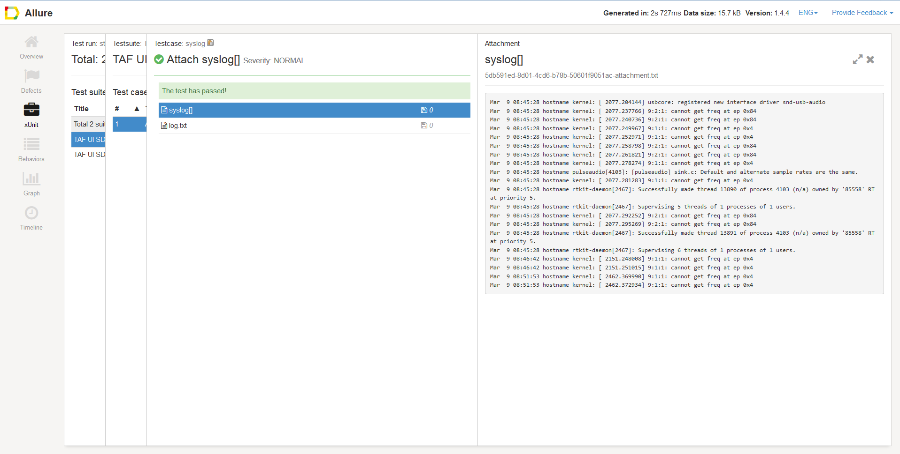

<head>
   <title>Adding log files to HTML report for test cases in TAF</title>
</head>

# Adding log files to HTML report for test cases in TAF

## How does it work

TAF allows users to add attachments to test cases by providing an annotation that can be set on a method called by the test case.

Example code

        @TestId(id = "syslog", title = "Attach syslog")
        @Test
        public void simpleTest() {
            LOGGER.info("Test case seems to have passed");
            attachSyslog();
        }

        @Attachment(value = "syslog", type = "text/plain")
        public byte[] attachSyslog() {
            byte[] response = null;
            try {
                response = Files.readAllBytes(Paths.get("/var/log/syslog"));
            } catch (IOException e) {
                LOGGER.error("Failed to read syslog", e);
            }
            return response;
        }

In the above example attachSyslog is annotated with `@Attachment`, the method that is annotated with @Attachment should return the file content as a String or a byte array to the test case.
In the above example the test case is retrieving the syslog on the host that is executing the tests.

Any file type can be attached, such as images, html, logs, text files, etc.

The `value` attribute is the name the file will be given in the Allure report.
The `type` attribute is the filetype, and can be any valid MIME type. For example, "text/plain" for text files, or "application/zip" for ZIP archives.

Below is the outcome of the above code in an Allure report.

