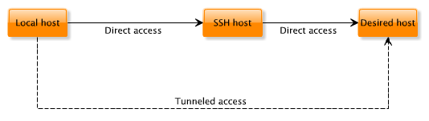
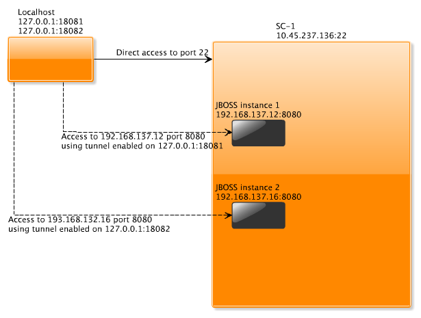
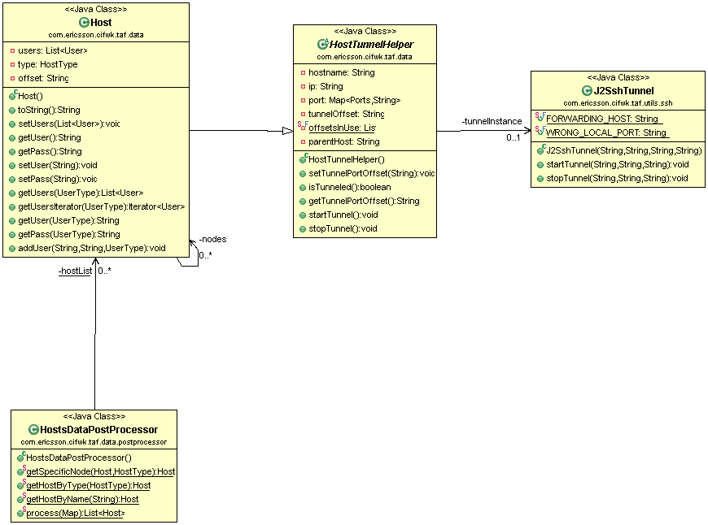

<head>
   <title>How to use SSH to tunnel to environment</title>
</head>

# How to use SSH to tunnel to environment

## Issue

One possible configuration is assuming certain services are exposed on IP addresses not available from external network.
To access them, SSH tunneling is suggested and TAF is providing support for this solution via Host object.

## SSH Tunnel

SSH tunneling or SSH port forwarding allows to access port on server that is not available using another server that can be accessed using SSH.



In the case of ENM Configuration, the private addresses are used to expose internal services e.g. by specifying them for JBOSS instances. Access to them can be established using SSH local port forwarding:



## Enabling

TAF handles SSH tunneling on Host objects during initial creation by HostDataPostProcessor. To enable tunneling “tunnel” property needs to be set to offset assigned to the node:

Hosts properties format <span style="color:#ba3925;">(<classpath_resources>/taf_properties/host.properties)</span>:

```
host.sc1.ip = 10.65.237.136
host.sc1.port.ssh = 22
host.sc1.user.root.pass = rootPass
host.sc1.user.root.type = admin
host.sc1.node.jbossInstance1.tunnel = 1
host.sc1.node.jbossInstance1.ip = 192.168.137.12
host.sc1.node.jbossInstance1.port.http = 8080
host.sc1.node.jbossInstance1.port.ssh = 22
host.sc1.node.jbossInstance1.user.operator-user.pass = operator-user-password
host.sc1.node.jbossInstance1.user.operator-user.type = oper
host.sc1.node.jbossInstance2.tunnel = 2
host.sc1.node.jbossInstance2.ip = 192.168.137.16
host.sc1.node.jbossInstance2.port.http = 8080
host.sc1.node.jbossInstance2.port.ssh = 22
host.sc1.node.jbossInstance2.user.operator-user.pass = operator-user-password
host.sc1.node.jbossInstance2.user.operator-user.type = oper
```

Hosts JSON format (<classpath_resources>/taf_properties/host.properties.json):

```
[
    {
        "hostname": "sc1",
        "ip": "10.65.237.137",
        "type": "sc1",
        "users": [
            {
                "username": "root",
                "password": "rootPass",
                "type": "admin"
            }
        ],
        "ports": {"ssh": 22},
        "nodes": [
        {
            "tunnel": 1,
            "hostname": "jbossInstance1",
            "ip": "192.168.137.12",
            "type": "jboss",
            "users": [
            {
                "username": "operator-user",
                "password": "operator-user-password",
                "type": "oper"
                }
            ],
            "ports": {
                "ssh": 22,
                "http": 8080
            }
        },
        {
            "tunnel": 2,
            "hostname": "jbossInstance2",
            "ip": "192.168.137.18",
            "type": "jboss",
            "users": [
            {
                "username": "operator-user",
                "password": "operator-user-password",
                "type": "oper"
            }
        ],
        "ports": {
            "ssh": 22,
            "http": 8080
        }
    }
]
```

During parsing and creation of the Host object, startTunnel method will be called automatically and IP and PORT properties of the Host object will be overridden to use SSH forwarding.

:------- | :--------
**NOTE** | Setting tunnel in host.properties file is enough to enabled SSH tunneling in background. There is nothing else to do.

jbossInstance1 will have port 8080 available on localhost port 18081 (10000 for dynamic range + 8080 to map the port + 1 for tunnel offset) or next available port. For TAF handlers this is all transparent as after getting the Host object ports and IP is overridden:

```java
Host jb1 = DataHandler.getHostByName("jbossInstance1");
assertEquals(jb1.getIp(), "127.0.0.1");
assertEquals(jb1.getPort().get(Ports.HTTP), "18081");
assertEquals(jb1.getPort().get(Ports.SSH), "10023");
Host jb2 = DataHandler.getHostByName("jbossInstance2");
assertEquals(jb2.getIp(), "127.0.0.1");
assertEquals(jb2.getPort().get(Ports.HTTP), "18082");
assertEquals(jb2.getPort().get(Ports.SSH), "10024");
```java

:-----------  | :--------
**IMPORTANT** | To enable SSH tunnel, the following things are required:

1. **ssh port and user** should be **defined** in both gateway and node hosts

2. **tunnel** offset needs **to be unique** - one offset number for 1 node

3. (in case of JSON format) **host type** value is selected **only** from **predefined** set (<span style="color:#ba3925;">com.ericsson.cifwk.taf
.data.HostType</span>) [HostType] (https://taf.seli.wh.rnd.internal.ericsson.com/apidocs/Latest/com/ericsson/cifwk/taf/data/HostType.html)

## Components


