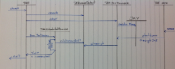

<head>
    <title>TAF runtime control by stopping one version when starting new</title>
</head>

# TAF runtime control by stopping one version when starting new

**Problem:**

Possibility to do a hot redeploy of tests by stopping one version and starting new TAF runtime, which is controllable via Jenkins
jobs and allows deployment and running of tests

**Solution:**

Add into TAF runtime JMX service which allows control of TAF (stop) through Java JMX API

## Components:

TAF

* Create and store TafRunnerContext
* Start TafJMXManagement
* Start TestNG and execute all test cases throught TafScheduledTestRunnervv
* Stop TafJMXManagement

TafRunnerContext

Provide TAF Runtime context variables:

* 'isInterrupted'
* 'isTerminated'
* TAF Runtime name

TafJMXManagement

* Check system property "taf.manadement" and start if it is defined
* Try to find "old Taf runtime" through JMX
* Try to shutdown or kill "old Taf runtime" through JMX MBean com.ericsson.cifwk.taf:type=TafManager
* Create JMX MBean TafJMXManager and register it into JMX

TafJMXManager

* Implement TafManager interface and provide it’s functionality through JMX
* send received JMX command to TafRunnerContext

TafScheduledTestRunner

* Check isInterrupted on TafRunnerContext
* Stop all testcases if Taf runtime is interrupted

## TAF Runtime control flow:



## TAF Runtime control parameters:

System property

* <span style="color:#ba3925;">taf.management</span>

Used to control TafJMXManagement possible value: <span style="color:#ba3925;">-D taf.management, -D taf.management=*, -Dtaf.management=servicename{;otherservice}</span>

* TafJMXManagement enabled if <span style="color:#ba3925;">taf.management</span>

* is defined with empty value, such as <span style="color:#ba3925;">-Dtaf.management</span>

* TafJMXManagement enabled if <span style="color:#ba3925;">taf.management</span> is defined with * (star) value, such as <span style="color:#ba3925;">-Dtaf.management=*</span>

* TafJMXManagement enabled if <span style="color:#ba3925;">taf.management</span> is defined with service list and of the services name is jmxlocal, such as <span style="color:#ba3925;">-Dtaf.management=jmxlocal</span>

How to use:

* from command line: <span style="color:#ba3925;">mvn test -Dtaf.management …</span>other parameters

* in pom.xml, add systemProperty taf.management info exec-maven-plugin/configuration

System properties:

* <span style="color:#ba3925;">taf.groupId</span>

* <span style="color:#ba3925;">taf.artifactId</span>

* <span style="color:#ba3925;">taf.version</span>


Used to create Taf Runtime name such as taf.groupId:taf.artifactId:taf:version. This name used by TafJmxManagement to find corresponding old Taf runtime.
TafJMXManagement stop old Taf runtime is current Taf runime has same name value. If you do not define any or all of the values, the will use the defaults value:

* or <span style="color:#ba3925;">taf.groupId</span> default value is <span style="color:#ba3925;">com.ericsson.cifwk.taf</span>

* for <span style="color:#ba3925;">taf.arfifactId</span> default value is <span style="color:#ba3925;">testcases</span>

* for <span style="color:#ba3925;">taf.version</span> default value is 0 if you are not specifying any values, default Taf Runtime name is <span style="color:#ba3925;">com.ericsson.cifwk.taf:testcases:0</span>

How to use:

* from command line: <span style="color:#ba3925;">mvn test -Dtaf.groupId=my.team.project …</span>other parameters

* in pom.xml, add <span style="color:#ba3925;">systemProperty</span> info <span style="color:#ba3925;">exec-maven-plugin/configuration</span>

How to stop Old Taf Runtime w/o running new tests

* Use non-existent suite name on command line: <span style="color:#ba3925;">mvn test -Dsuites=Jabberwocky</span>

* or create empty suites.xml, such as **stop-taf.xml**

```
<!DOCTYPE suite SYSTEM "http://testng.org/testng-1.0.dtd" >
<suite name="stop-taf" />
```

and use <span style="color:#ba3925;">mvn test -Dsuites=stop-taf.xml</span> in command line

or add it’s on pom.xml to <span style="color:#ba3925;">exec-maven-plugin/configuration</span> in pom.xml.

