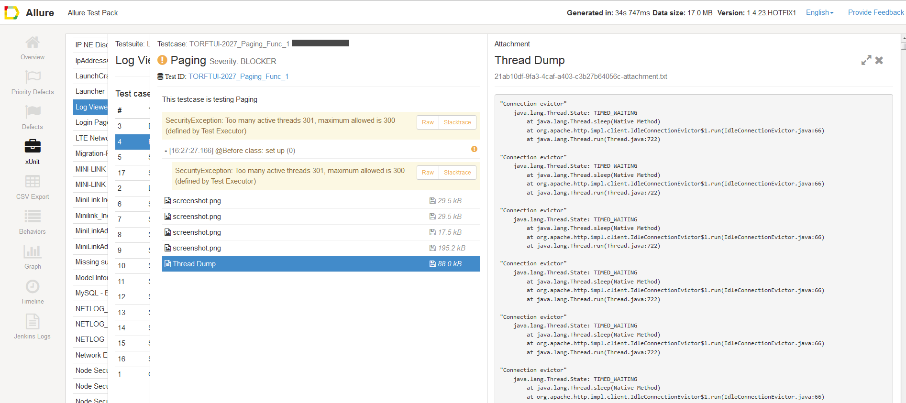

<head>
   <title>How to make sure you're not creating too many threads</title>
</head>

# How to make sure you're not creating too many threads

**Problem:**

Testware can create too many threads and fail, or affect other tests,
which won't be able to create a new thread because all of them are consumed by your testware.

To prevent this, TAF TE has a control mechanism that limits the max thread amount per test schedule item to 1,000.
However, you probably want to make sure that you (or the shared test steps you use)
are not creating too much before your tests get into MT loop.

**Solution:**

1. Add the following to your testware POM:

```
<dependency>
    <groupId>com.ericsson.cifwk.taf.executor</groupId>
    <artifactId>te-runtime</artifactId>
    <version>1.0.64</version>
</dependency>
```

2. Run your scenario from IDE, adding the following parameters to VM parameters:

*-Djava.security.manager=com.ericsson.cifwk.taf.executor.security.TestRuntimeSecurityManager*

*-Dtaf.jvm.threads.limit=&lt;the number you want&gt;* (for example, 100)


If your testware will approach the defined limit, you will first get warnings,
and when you reach it, you will get a thread dump and an exception.

Example from [real test execution](https://oss-taf-logs.seli.wh.rnd.internal.ericsson.com/c3c718f6-a3a9-4851-868b-672e0dc9256b/te-console-logs/LogViewerMavericks.log):

```
................
2017-01-18 16:26:57,581 [pool-1-thread-1] [WARN] [com.ericsson.cifwk.taf.executor.security.TestRuntimeSecurityManager] Active threads number (295) will soon reach the limit (300) defined by TAF Test Executor
2017-01-18 16:26:57,677 [pool-1-thread-1] [WARN] [com.ericsson.cifwk.taf.executor.security.TestRuntimeSecurityManager] Active threads number (296) will soon reach the limit (300) defined by TAF Test Executor
2017-01-18 16:26:57,773 [pool-1-thread-1] [WARN] [com.ericsson.cifwk.taf.executor.security.TestRuntimeSecurityManager] Active threads number (297) will soon reach the limit (300) defined by TAF Test Executor
2017-01-18 16:26:57,882 [pool-1-thread-1] [WARN] [com.ericsson.cifwk.taf.executor.security.TestRuntimeSecurityManager] Active threads number (298) will soon reach the limit (300) defined by TAF Test Executor
2017-01-18 16:26:57,962 [pool-1-thread-1] [WARN] [com.ericsson.cifwk.taf.executor.security.TestRuntimeSecurityManager] Active threads number (299) will soon reach the limit (300) defined by TAF Test Executor
2017-01-18 16:26:58,044 [pool-1-thread-1] [WARN] [com.ericsson.cifwk.taf.executor.security.TestRuntimeSecurityManager] Active threads number (300) will soon reach the limit (300) defined by TAF Test Executor
2017-01-18 16:26:58,139 [pool-1-thread-1] [ERROR] [com.ericsson.cifwk.taf.executor.security.TestRuntimeSecurityManager] Too many active threads 301, maximum allowed is 300 (defined by Test Executor)
2017-01-18 16:26:58,141 [pool-1-thread-1] [WARN] [com.ericsson.cifwk.taf.executor.security.TestRuntimeSecurityManager] Getting Thread Dump...
2017-01-18 16:26:58,167 [pool-1-thread-1] [WARN] [com.ericsson.cifwk.taf.executor.security.TestRuntimeSecurityManager] Getting Thread Dump took 24 millis
2017-01-18 16:26:58,170 [pool-1-thread-1] [ERROR] [com.ericsson.cifwk.taf.executor.security.TestRuntimeSecurityManager] Thread Dump:

"Connection evictor"
    java.lang.Thread.State: TIMED_WAITING
        at java.lang.Thread.sleep(Native Method)
        at org.apache.http.impl.client.IdleConnectionEvictor$1.run(IdleConnectionEvictor.java:66)
        at java.lang.Thread.run(Thread.java:722)

"Connection evictor"
    java.lang.Thread.State: TIMED_WAITING
        at java.lang.Thread.sleep(Native Method)
        at org.apache.http.impl.client.IdleConnectionEvictor$1.run(IdleConnectionEvictor.java:66)
        at java.lang.Thread.run(Thread.java:722)
................
```

If you get a thread dump, it will also be attached to the Allure report:



3. Alternatively, you can run the test via test-pom, defining *java.security.manager*
and *taf.jvm.threads.limit* as TAF test Maven plugin parameters:

```
<plugin>
    <groupId>com.ericsson.cifwk.taf</groupId>
    <artifactId>taf-maven-plugin</artifactId>
    <version>....</version>
    <executions>
         <execution>
             <goals>
                 <goal>test</goal>
             </goals>
             <configuration>
                 ..............
                 <properties>
                     <java.security.manager>com.ericsson.cifwk.taf.executor.security.TestRuntimeSecurityManager</java.security.manager>
                     <taf.jvm.threads.limit>100</taf.jvm.threads.limit>
                 </properties>
                 .............
             </configuration>
         </execution>
    </executions>
</plugin>
```

**Please note that this feature is only for local debugging, and should not be committed to the source code repository!**
