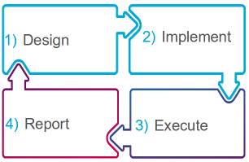

<head>
   <title>What Is TAF</title>
</head>

# What Is TAF

The Test Automation Framework (TAF) is a solution that enables users to design, implement,
execute and report automated tests written in Java.

TAF follows the paradigm of convention over configuration. There is a consistent maven archetype, and suggested
class structure that enables easier maintenance of test code. This enables components to be easily shared between teams.
Since all TAF testware follow the same approach, competence sharing amongst teams is also easier.

TAF is a heavily modularised framework. The advantage of this is that it allows for tool abstraction.
This means that a user of TAF does not need to know the nuts and bolts of how a certain tool completes a task, but
merely that it does so. Also, it means that components can be changed behind the scenes, without users even being
aware of it. Tool abstraction gives great flexibility to the design of TAF.

TAF supports execution of tests from your local machine and from a Continuous Integration framework via Jenkins.
TAF also supports test case reporting via the Allure framework.

Framework's evolve as they are being used and as such, TAF is under constant development to improve and evolve. The TAF
team strive to ensure that TAF is backward compatible by utilizing a rigorous release cycle. When a change is non-backward
compatible, it will be communicated to all users.

It is best practice to use the latest recommended version of TAF whenever possible as older functionality will be deprecated and
unsupported over time.

