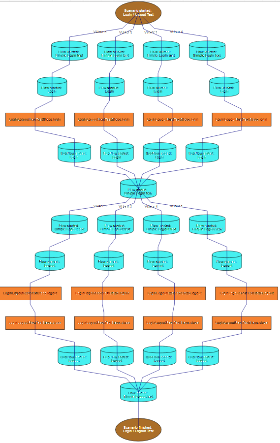
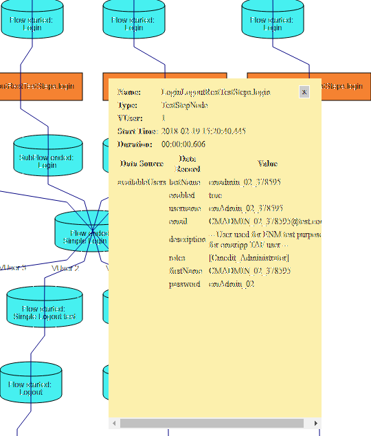
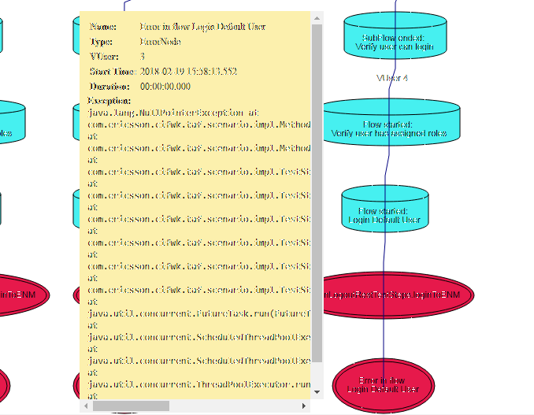

<head>
   <title>Scenarios - Debug</title>
</head>

# Scenario Debug

## Overview

Since _TAF 2.12.6+_ its possible to visualize TAF scenario flow and track progress during execution. After scenario is finished output would be saved in GraphML and svg formats.

This is useful for:

+ Overview of scenario logic in Allure reports
+ Debug in cases of test failure

Exemple of visualization:

It's possible to view TestStep vUser, duration and data records coming from each data source :

In case of error its possible to view stacktrace:

For more informations please refer to [Page in confluence]    
(https://confluence-oss.seli.wh.rnd.internal.ericsson.com/display/TAF/Visualization+of+Scenarios) 

#### Colors Customization

Since _TAF 2.37.19+_ you can also change background and font colors setting some properties: you can change its values in property file, or in 
command line. Here you can
 see
 list of properties for each element in scenario visualization.

    scenario.node.rootStart.fillcolor   
    scenario.node.rootStart.fontcolor
    scenario.node.rootStart.shape   
    scenario.node.rootEnd.fillcolor   
    scenario.node.rootEnd.fontcolor
    scenario.node.rootEnd.shape   
    scenario.node.flowStart.fillcolor   
    scenario.node.flowStart.fontcolor
    scenario.node.flowStart.shape   
    scenario.node.flowEnd.fillcolor   
    scenario.node.flowEnd.fontcolor
    scenario.node.flowEnd.shape   
    scenario.node.sync.fillcolor    
    scenario.node.sync.fontcolor
    scenario.node.sync.shape    
    scenario.node.teststep.fillcolor    
    scenario.node.teststep.fontcolor
    scenario.node.teststep.shape    
    scenario.node.error.fillcolor   
    scenario.node.error.fontcolor
    scenario.node.error.shape   

Some colors exemple are in next lines:

        COLOR_RED =       "#e6194b"
        COLOR_GREEN =     "#3cb44b"
        COLOR_YELLOW =    "#ffe119"
        COLOR_BLUE =      "#0082c8"
        COLOR_ORANGE =    "#f58231"
        COLOR_PURPLE =    "#911eb4"
        COLOR_CYAN =      "#46f0f0"
        COLOR_MAGENTA =   "#f032e6"
        COLOR_LIME =      "#d2f53c"
        COLOR_PINK =      "#fabebe"
        COLOR_TEAL =      "#008080"
        COLOR_LAVENDER =  "#e6beff"
        COLOR_BROWN =     "#aa6e28"
        COLOR_BEIGE =     "#fffac8"
        COLOR_MAROON =    "#800000"
        COLOR_MINT =      "#aaffc3"
        COLOR_OLIVE =     "#808000"
        COLOR_CORAL =     "#ffd8b1"
        COLOR_NAVY =      "#000080"
        COLOR_GREY =      "#808080"
        COLOR_WHITE =     "#FFFFFF"
        COLOR_BLACK =     "#000000"

And some available shape, to change default ones:

        SHAPE_RECTANGLE =       "rectangle"
        SHAPE_ELLIPSE =         "ellipse"
        SHAPE_DOUBLE_ELLIPSE =  "doubleEllipse"
        SHAPE_RHOMBUS =         "rhombus"
        SHAPE_CYLINDER =        "cylinder"
        SHAPE_CLOUD =           "cloud"
        SHAPE_TRIANGLE =        "triangle"
        SHAPE_HEXAGON =         "hexagon"

## Allure report

1.  Run TAF with argument: -Dtaf.scenario.debug.enabled=true.

2.  When Allure report will be generated, .svg file will be attached to it.

3.  Links to scenario graph will be located in Allure → Overview → Environment block.

## Visualization in browser

1.  Run TAF with arguments:

2.  -Dtaf.scenario.debug.enabled=true.

3.  -Dtaf.scenario.debug.port=_8787_ where 8787 is available open port on environment.

4.  After line Scenario debug is available on... appeared in logs, point browser to [http://localhost:PORT/api/scenario.svg](http://localhost:PORT/api/scenario.svg).
    (IE is not supported because lack of support of HTML if foreignObject)

5.  Click on graph nodes to view more info.

6.  After scenario is finished you can open file  target/taf-scenario/scenario_name.svg with your browser. You may look at log for full file path.

## Visualization in yEd tool

1.  Download [yEd](https://www.yworks.com/en/products/yfiles/yed/)

2.  File -> Prefences set Tooltips Displays Duration to 30.

3.  Edit -> Properties Mapper press Imports and select file [scenarios.cnfx](link:/download/attachments/119796357/scenarios.cnfx)

4.  Run TAF with arguments:

5.  -Dtaf.scenario.debug.enabled=true to save GraphML file after scenario is finished.

6.  -Dtaf.scenario.debug.port=8787 where _8787_ is available open port to debug scenario during execution.

3.  -Dtaf.scenario.debug.show.sync.points=true to show Sync Points on resulting graph.

5.  To view execution graph:

    * If scenario is running and debug port is set: File→  Open URL and [http://localhost:PORT/api/scenario.graphml](inputhttp://localhost:PORT/api/scenario.graphml) where.

    * If scenario is finished: File->Open and select target/taf-scenario/scenario_name.graphml. You may look at log for full file path.

6. Edit → Properties Mapper:
* select Taf Scenario (Node) configuration and press Apply
* select Taf Scenario (Edge) configuration and press Apply
7.  Press Layout → Hierarchical and Ok

## Analysis with Java

It's also possible to analyze GraphML file with Java. For example you can:

* Find failed TestSteps

* Find TestSteps that take most time

* Find TestSteps that were called with given with DataRecord

* ...

You may load file with Jackson and work with nodes (which represent Flows, TestSteps, ...) as Java beans. For example you may filter it via Java8 streams.

Example project: [GraphSearchExample.zip](https://confluence-oss.seli.wh.rnd.internal.ericsson.com/download/attachments/119796357/GraphSearchExample.zip)

