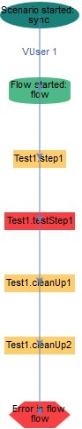

<head>
   <title>Scenarios - Extending Scenarios</title>
</head>

# Extending Scenarios

## Adding Multiple Flows

### SubFlows
Provides functionality to execute a flow within another flow. This way a separate data source can be specified within this inner flow. There could
be multiple levels of such subflows. SubFlow Runs with the same vUser as parent flow, i.e. you can get variables from parent context, and access parent
<span style="color:#ba3925;">@VUserScoped</span> operators.

:-------- | :------------
**NOTE:** | SubFlow can be executed with only one vUser. To execute SubFlow with multiple vUsers use split();

In the example below we login to the system as one user, send all emails specified in emailContent and then logout of the system.

```java
TestStepFlow sendMultipleEmails= flow("Login to email server and send email")
            .addTestStep(annotatedMethod(sendEmailTestSteps, "login"))
            .addSubFlow(
                flow("Send email")
                .addTestStep(annotatedMethod(sendEmailTestSteps, "composeEmail"))
                .addTestStep(annotatedMethod(sendEmailTestSteps, "setMailFields"))
                .addTestStep(annotatedMethod(sendEmailTestSteps, "sendEmail"))
                .withDataSources(dataSource("emailContent"))
                .build())
                )
            .addTestStep(annotatedMethod(sendEmailTestSteps, "logout"))
            .withDataSources(dataSource("users"))
            .build();
```


#### Split

Functionality that allows execution of flows in parallel and allows for synchronization of execution completion. In the example below we login
to email system, we then split execution to send and receive emails at the same time, once both of these flows are complete we logout of the system.

```java
TestScenario scenario = scenario("split-merge")
        .addFlow(
            flow("login").addTestStep(annotatedMethod(sendEmailTestSteps, "Login"))
            .withDataSources(dataSource("users"))
            )
        .split(
            flow("sendEmail")
                .addTestStep(annotatedMethod(sendEmailTestSteps, "composeEmail"))
                .addTestStep(annotatedMethod(sendEmailTestSteps, "setMailFields"))
                .addTestStep(annotatedMethod(sendEmailTestSteps, "sendEmail"))
                .withDataSources(dataSource("mailContent")),
            flow("receiveEmail")
                .addTestStep(annotatedMethod(sendEmailTestSteps, "openMailFolder"))
                .addTestStep(annotatedMethod(sendEmailTestSteps, "openMail"))
                .withDataSources(dataSource("mailContent"))
            )
        .addFlow(
            flow("logout").addTestStep(annotatedMethod(sendEmailTestSteps, "logout"))
            .withDataSources(dataSource("users"))
            )
        .build();
```


Split allows to execute multiple flows in parallel. There could be multiple levels of split. Flows can have any amount of vUsers.
Each flow will have its own vUser.


Example: to achieve execution above, following code was used:

```java
TestScenario scenario = scenario("doParallel-merge")
    .addFlow(
            flow("flow")
                .split(
                    flow("parallel flow 1")
                            .split(
                                  flow("sub parallel flow 1")
                                         .addTestStep(createStep("sub parallel 1"))
                                         .withVusers(2),
                                  flow("sub parallel flow 2")
                                         .addTestStep(createStep("sub parallel 2"))
                            )
                            .withVusers(2),
                    flow("parallel flow 2")
                            .addTestStep(createStep("parallel 2"))

                )
    )
    .addFlow(
            flow("this flow will execute after parallel flows finish")
                    .addTestStep(createStep("merge step"))
    )
    .build();
```

## With Parameter

It is also possible to use test step with parameters. Parameters use the same approach as data sources. Parameter is being passed into method attributes
annotated with @Input. The difference is that parameters can be set in the code, rather in separate data source files. It makes possible to reuse test
steps in different scenarios by supplying parameter attributes. See the example below on how to use parameters.

```java
TestStepFlow flow = flow("Login")
    .addTestStep(annotatedMethod(sendEmailTestSteps, "login")
            .withParameter("username", "ejohsmi")
            .withParameter("password", "pass"))
    .build();
```

**NOTE:** the value for the input parameter, in the withParameter method call, takes priority over the input parameter specified in the data source.

### When to use withParameter

* The data value is the same for every data record.
* The data is generated during execution in an earlier test step, see [Passing Data Between Test Steps and Flows](flow.html)

#### Using data from another column in datasource

You are also able to use data from a different column when reusing the same test step :

user logs in, changes password, logs out then logs back in with new password

```
username,password,newpassword
JohnSmith,originalPass,changedPass
```

```java
import static com.ericsson.cifwk.taf.scenario.TestScenarios.fromDataSourceField;

TestStepFlow flow = flow("CheckNewPassword")
    .addTestStep(annotatedMethod(sendEmailTestSteps, "login"))
    .addTestStep(annotatedMethod(userManagementTestSteps, "changePassword"))
    .addTestStep(annotatedMethod(sendEmailTestSteps, "logout"))
    .addTestStep(annotatedMethod(sendEmailTestSteps, "login")
        .withParameter("password", fromDataSourceField("newpassword")))
    .withDataSources(dataSource("users"))
    .build();
```

It is also possible to use data from another datasource
```
username,password,newpassword
JohnSmith,originalPass,changedPass
```

```
secondnewpassword
secondNewPass
```

```java
import static com.ericsson.cifwk.taf.scenario.TestScenarios.fromDataSourceField;

TestStepFlow flow = flow("CheckNewPassword")
    .addTestStep(annotatedMethod(sendEmailTestSteps, "login"))
    .addTestStep(annotatedMethod(userManagementTestSteps, "changePassword"))
        .withParameter("newpassword", fromDataSourceField("newdata", "secondnewpassword")))
    .addTestStep(annotatedMethod(sendEmailTestSteps, "logout"))
    .addTestStep(annotatedMethod(sendEmailTestSteps, "login")
        .withParameter("password", fromDataSourceField("newdata", "secondnewpassword")))
    .withDataSources(dataSource("users"), datasource("newdata"))
    .build();
```

## Always Run Test Step

Test Steps with parameter <span style="color:#ba3925;">.alwaysRun()</span> will be called regardless if Test Steps in previous flow had failed (have thrown unhandled exception). This is useful to
perform cleanup actions that are not depending if test succeeds of fails, for example to close browser. Steps will be called for each vUser and with same operators
and data records as previous steps.

If you need perform cleanup not dependent on vUsers, consider using **afterFlow**.

### Example 1:

```java
TestScenario scenario = scenario("Scenario 1")
        .addFlow(flow("main")
                        .addTestStep(annotatedMethod(this, "step1"))
                        .addTestStep(annotatedMethod(this, "throwExceptionStep"))
                        .addTestStep(annotatedMethod(this, "step2"))
                        .addTestStep(annotatedMethod(this, "cleanUp1").alwaysRun())
                        .addTestStep(annotatedMethod(this, "cleanUp2").alwaysRun())
                        .withDataSources(dataSource(CSV_DATA_SOURCE))
        )
        .build();
```

Will produce following graph:



In this case <span style="color:#ba3925;">step1</span> will be called normally. Next in <span style="color:#ba3925;">throwExceptionStep</span> step unhanded exception will be thrown,
so <span style="color:#ba3925;">step2</span> will not be called. Steps <span style="color:#ba3925;">cleanUp1</span> and <span style="color:#ba3925;">cleanUp2</span> will be called anyways with same
data records as <span style="color:#ba3925;">step1</span>.

In addition to that, exception thrown by <span style="color:#ba3925;">throwExceptionStep</span> will be
stored in context attribute <span style="color:#ba3925;">TestStepResult.LAST_FAILED_TEST_STEP</span> and
could be retrieved in <span style="color:#ba3925;">cleanUp1</span> and <span style="color:#ba3925;">cleanUp2</span> Test Steps:

```java
@TestStep(id = "cleanUp1")
public void cleanUp1(
        @Input("user") ENMUser user,
        @Input("node") NetworkNode node) {

    TestStepResult result = TafTestContext.getContext().getAttribute(TestStepResult.LAST_FAILED_TEST_STEP);
    if (TEST_STEP_1.equals(result.getName()) &&
        result.getException() instanceof SomeSpecificException) {
        //...
    }
}
```

In case with many vUsers, <span style="color:#ba3925;">cleanUp1</span> will be called with context of each vUser therefore allowing to access
same <span style="color:#ba3925;">@VUserScoped</span> operators.

If given scenario will be called with <span style="color:#ba3925;">.withVusers(2)</span> and <span style="color:#ba3925;">throwExceptionStep</span> will throw
exception only for 1 vUser, graph will
be following:


**NOTE:** If step marked alwaysRun throws unhanded exception, **exception handler** will be called for all exceptions, but only the last will be propagated. So if
in example before, steps <span style="color:#ba3925;">throwExceptionStep</span>, <span style="color:#ba3925;">cleanUp1</span> and <span style="color:#ba3925;">cleanUp2</span> will throw
exceptions, only exception thrown by <span style="color:#ba3925;">cleanUp2</span> will be propagated.

**NOTE:** alwaysRun Test Step will be called _only if flow was started_. As result of this rule:

* Data Source iteration will be stopped not depending if there are Test Steps marked alwaysRun. So if in example before, CSV_DATA_SOURCE contained 3 rows,
  it will be called only with first one (because flow with 2nd and 3rd rows will not be started).

* alwaysRun step should contain cleanup for current flow only. If unhanded exception was thrown in step before subflow defined, _subflow will not be started_
  therefore alwaysRun steps defined in subflow will not be called. Please refer to Example 2.

### Example 2

Scenario with exception thrown before subflow definition:

```java
TestScenario scenario = scenario("sync")
    .addFlow(
        flow("flow")
            .addTestStep(annotatedMethod(this, "step1")
            .addSubFlow(
                flow("subFlow1")
                        .addTestStep(annotatedMethod(this, "subFlow1CleanUp".alwaysRun())
            )
            .addTestStep(annotatedMethod(this, "throwExceptionStep"))
            .addTestStep(subFlow(
                flow("subFlow2")
                        .addTestStep(annotatedMethod(this, "subFlow2CleanUp".alwaysRun())
            ))
            .addTestStep(annotatedMethod(this, "cleanUp".alwaysRun())
    )
```

Will produce following graph:


* <span style="color:#ba3925;">subFlow1CleanUp</span> will be called because <span style="color:#ba3925;">subFlow1</span> is defined before exception was thrown in <span style="color:#ba3925;">throwExceptionStep</span>
* <span style="color:#ba3925;">subFlow2CleanUp</span> will be _not_ called because <span style="color:#ba3925;">subFlow2</span> is defined _after_ exception was thrown in <span style="color:#ba3925;">throwExceptionStep</span>, and therefore <span style="color:#ba3925;">subFlow2</span> was not started
* <span style="color:#ba3925;">cleanUp</span> will be called because it's defined in same <span style="color:#ba3925;">flow</span> as <span style="color:#ba3925;">throwExceptionStep</span>

## Always Run Test Flow

Test Flows added with method <span style="color:#ba3925;">.alwaysRunFlow(TestStepFlow flow)</span> will be called regardless if previous flow threw an unhandled exception. This
is useful to perform cleanup actions that are not depending if test succeeds of fails, for example to close browser or delete mock data from stateful resource.

### Example 3

Scenario with exception thrown in flow1. There are 2 flows, flow1 throws an exception, but alwaysFlow1 will continue execution as if there was no exception in previous flow.

```java
TestScenario scenario = scenario("sync")
    .addFlow(
            flow("flow1")
                .addTestStep(annotatedMethod(this, "step1")
                .addTestStep(annotatedMethod(this, "throwExceptionStep"))
    )
    .alwaysRunFlow(
           flow("alwaysFlow1")
                .addTestStep(runnable(pushToStack("alwaysFlow1Step1")))
                .addTestStep(throwExceptionForVUser(1))
                .addTestStep(runnable(pushToStack("alwaysFlow1Step2")).alwaysRun())
                .withDataSources(dataSource(CSV_DATA_SOURCE))
    )
    .build();
```

## Scenario Listeners

The easiest way to hook into the Scenario execution process is by adding custom Scenario Listeners to the Scenario Runner builder:

```java
ScenarioListener listener = new YourCustomScenarioListener();

TestScenarioRunner runner = TestScenarios.runner()
        .withListener(listener)
        .build();
```

Interface `ScenarioListener` provides the following self-describing methods called during various Scenario execution phases:

* `void onScenarioStarted(TestScenario scenario)`
* `void onScenarioFinished(TestScenario scenario)`
* `void onFlowStarted(TestStepFlow flow)`
* `void onFlowFinished(TestStepFlow flow)`
* `void onTestStepStarted(TestStepInvocation invocation, Object[] args)`
* `void onTestStepFinished(TestStepInvocation invocation)`

If you need only some of the `ScenarioListener` methods, consider extending `AbstractScenarioListener` 
and overriding only those methods that you are interested in, instead of implementing `ScenarioListener`.

Class `ExtendedScenarioListener` has overloaded versions of two methods. 

* `onTestStepFinished`, which has an additional argument `TestStepResult result` for accessing information regarding Test Step execution result. 
* `onFlowFinished`, which has an additional argument `TestFlowResult result` for accessing information regarding Flow execution result.

**NOTE**

* Scenario Listeners are **not** meant for modifying Scenario execution process, use them for getting notified about Scenario execution events
* Scenario Listeners **must not** throw any exceptions, as they will not be handled by Exception Handlers, and thus will break Scenario execution 
* Scenario Listeners are executed *synchronously*, therefore consider not putting any long-time running operations into them, as it will block Scenario execution

## Exception Handling

In case an exception is thrown during flow execution it is caught and provided to exception handler. It's possible to select one from predefined exception handlers:

* `ScenarioExceptionHandler.PROPAGATE` - Stop Flow execution and propagate exception to next level exception handler (i.e. Sub Flow → Flow → Scenario). If there are no more handlers defined, exception will be propagated to main thread.
* `ScenarioExceptionHandler.IGNORE` - If handler ignores exception, Flow execution will continue, and no other handlers will be called.
* `ScenarioExceptionHandler.LOGONLY` - Catch and log the exception but does not fail the test

**NOTE**: Do not use IGNORE and LOGONLY exception handler to execute mandatory finalization/cleanup Test Steps in case one of Test Steps is failed.
 Use [Always Run Test Step](#Always_Run_Test_Step) for such purpose. IGNORE and LOGONLY Handlers are for debugging purposes.

For granularity it's possible to set exception handler for each flow. For example:

```java
        TestScenario scenario = scenario("scenario")
                .addFlow(
                        flow("flow")
                                .addSubFlow(flow("subFlow")
                                        .withExceptionHandler(subFlowHandler) //<--
                                )
                                .withExceptionHandler(flowHandler) //<--
                )
                .withExceptionHandler(scenarioHandler) //<--
                .build();
```

Additionally it's possible to set Exception Handler in Scenario Runner, which will set Exception Handler for all Scenarios which will be started with this Runner:

```java
runner().withDefaultExceptionHandler(runnerHandler).build().start(scenario);
```

### Implementing custom Exception Handler

To create custom Exception Handler implement `com.ericsson.cifwk.taf.scenario.api.ScenarioExceptionHandler` interface. Implementation should return one of following enums:

* `ScenarioExceptionHandler.Outcome.PROPAGATE_EXCEPTION` - Stop Flow execution and propagate exception to next level exception handler (i.e. Sub Flow → Flow → Scenario). If there are no more handlers defined, exception will be propagated to main thread.
* `ScenarioExceptionHandler.Outcome.CONTINUE_FLOW` - If handler ignores exception, Flow execution will continue, and no other handlers will be called.

**NOTE** Exception Handler implementation should not throw exceptions itself. If Exception Handler throws exception, Scenario execution will be terminated despite any other
exception handlers.

### Exception Handling Hierarchy

If you define Exception Handlers on multiple levels (i.e. scenario flow, flow and subflow), handlers will be called in order from more specific (in this case subflow)
to less specific (scenario level). If one of the Handlers will handle exception, other handlers will not be called. For example if subflow Handler will propagate exception
(i.e. return `ScenarioExceptionHandler.Outcome.PROPAGATE_EXCEPTION`) next handler will call flow Handler. If flow Handler handles exception (i.e. return `ScenarioExceptionHandler.Outcome.CONTINUE_FLOW`)
exception will be considered handled, and scenario exception handler will not be called.

If no Exception Handler is defined on flow, but Exception Handler on parent flow ignores exception, flow execution will continue. For example:

```java
      flow("flow")
                .addSubFlow(
                        flow("subFlow")
                                .addTestStep(step("beforeException"))
                                .addTestStep(throwException())
                                .addTestStep(step("afterException"))
                )
                .withExceptionHandler(flowHandler)
```

If exception happens in `subFlow` (where no Exception Handler defined) and `flowHandler` ignores exception, exception will be considered handled, and `subFlow` execution
will continue - step `afterException` will be executed.


### Multiple Exception Handlers

To set multiple Exception Handlers on any level use `com.ericsson.cifwk.taf.scenario.TestScenarios#compositeExceptionHandler` builder. In case all Exception Handlers will be called,
but only one (final) exception handler result will determine if exception is handled or ignored.

* To add Exception Handler that will be called use `.addExceptionHandler(handler)` builder method. It's possible to add as much handlers as needed.
* To set Exception Handler that will determine if exception is handled or ignored use `.setFinalExceptionHandler(handler)` builder method.

**NOTE:** | By default exception handler is set to `ExceptionHandler.PROPAGATE`

For example you want to write a scenario which logs in into the UI, interacts with the system and logs out. If anything goes wrong during execution you want the
scenario to terminate at that point, but you'd also like to take a screenshot, and log variables from context. So you add exception handlers
`TakeScreenshot` and `LogContext` which will be called without affecting flow execution. Then you set `.finalExceptionHandler` to `PROPAGATE` so flow
 execution stops.

```java
TestScenarioRunnerBuilder runner = runner()
                .withDefaultExceptionHandler(
                        compositeExceptionHandler()
                                .addExceptionHandler(new TakeScreenshot())
                                .addExceptionHandler(new LogContext())
                                .setFinalExceptionHandler(ScenarioExceptionHandler.PROPAGATE)
                                .build());

runner.start(scenario);
```

