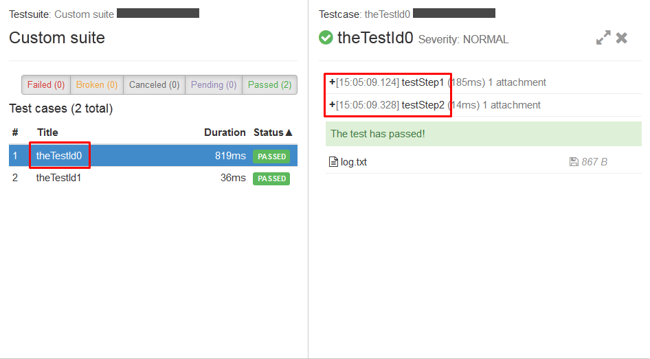
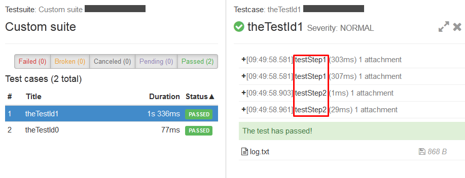

<head>
   <title>Scenarios - Manipulating Data</title>
</head>

# Manipulating Data

## TafDataSources

Test Data management can be a complex task. Aligning data between flows, providing data from different sources and aligning them all
together may require additional effort. To help with it TafDataSources class provides set of useful functionalities and methods allowing
complex manipulation of test data.

**<span style="color:#ba3925;">FromCsv</span>**

Creates a new DataSource instance based on 1 or more CSV files.
This can be done by specifying csv location or by specifying location and data source strategy.

Creating a DataSource from 1 Csv:

```java
TestDataSource<DataRecord> users = TafDataSources.fromCsv("data/user.csv");
```java

Creating a DataSource by combining 2 Csv files

```java
TestDataSource<DataRecord> users = TafDataSources.fromCsv("data/user.csv","data/user1.csv");
```java

```java
TestDataSource<DataRecord> users = TafDataSources.fromCsv("data/user.csv",DataPoolStrategy.REPEAT_UNTIL_STOPPED);
```java

**<span style="color:#ba3925;">FromClass</span>**

Creates a new DataSource from class with method annotated with @DataSource. This is done by passing class type to method or both class type and strategy.

```java
TestDataSource<DataRecord> users = TafDataSources.fromClass(UserDataSource.class);
```java

```java
TestDataSource<DataRecord> users = TafDataSources.fromClass(UserDataSource.class,DataPoolStrategy.REPEAT_UNTIL_STOPPED);
```java

**<span style="color:#ba3925;">Combine</span>**

Combines multiple data sources into one. Records (rows) from all data sources are simply appended to the resulting data source one after another.

<span style="color:#ba3925;">Data source Users1</span>

username  | password
:-------- | :---------
user1     | psw1
user2     | psw2


<span style="color:#ba3925;">Data source Users2</span>

username  | name
:-------- | :---------
user3     | John Smith
user4     | Jane Doe


<span style="color:#ba3925;">Data source Users3</span>

username  | password    | name
:-------- | :---------  | :---------
user5     | psw1        | John Smith
user6     | psw2        | Jane Doe


```java
TafDataSources.combine(Users1, Users2, Users3)
```java

<span style="color:#ba3925;">Combine</span>

username | password | name
:------- | :------- | :-------
user1    | psw1     |
user2    | psw2     |
user3    |          | John Smith
user4    |          | Jane Doe
user5    | psw1     | John Smith
user6    | psw2     | Jane Doe


**<span style="color:#ba3925;">Merge</span>**

Merges two data sources into one. Records columns (headers) are merged one by one.

<span style="color:#ba3925;">Data source Users</span>

username | password
:-------- | :---------
user1     | psw1
user2     | psw2
user3     |psw3


<span style="color:#ba3925;">Data source User2</span>

username | name
:------- | :---------
user1    | John Smith
user2    | Jane Doe
user4    | John Doe

```java
TafDataSources.merge(Users, User2)
```java

<span style="color:#ba3925;">Merge</span>

username | password | name
:------- | :------- | :-------
user1    | psw1     | John Smith
user2    | psw2     | Jane Doe
user4    | psw3     | John Doe

:-------- | :---------
**NOTE:** | Values from the second data source will overwrite the first one in case of header names match. In example above user3 username is lost.

**<span style="color:#ba3925;">Transform</span>**

Applies transformation function on the provided data source. Used to build a transformed data source instance.

<span style="color:#ba3925;">Data source Users</span>

username | password
:------- | :-------
user1    | psw1
user2    | psw2
user3    | psw3

```java
TestDataSource<DataRecord> transformed = TafDataSources.transform(users, new Function<DataRecord, DataRecord>() {

            @Override
            public DataRecord apply(DataRecord input) {
            Map<String, Object> users = Maps.newHashMap();
            users.putAll(input.getAllFields());
            users.put("name", "John Doe");
            return new DataRecordImpl(users);
        }
});
```java

:-------- | :---------
**NOTE:** | Transform must implement Function interface

<span style="color:#ba3925;">Transform</span>

username | password | name
:------- | :------- | :--------
user1    | psw1     | John Doe
user2    | psw2     | John Doe
user3    | psw3     | John Doe


**<span style="color:#ba3925;">Cyclic</span>**


Creates new data source with data from provided data source and sets data strategy to <span style="color:#ba3925;">REPEAT_UTIL_STOPPED</span>. Data will read in a loop, once
data source is depleted it will be read from beginning again. In the example below <span style="color:#ba3925;">usersRepeatUntilStopped</span> is a new data source which contains
the same data as users data source but has strategy <span style="color:#ba3925;">REPEAT_UTIL_STOPPED</span>.

```java
TestDataSource<DataRecord> users = TafDataSources.fromCsv("data/user.csv");

TestDataSource usersRepeatUntilStopped = TafDataSources.cyclic(users);

TestContext context = TafTestContext.getContext();
context.addDataSource("usersRepeatUntilStopped", usersRepeatUntilStopped);
```java

To stop loop you need to call <span style="color:#ba3925;">DataSourceControl.stopExecution(NAME)</span>. <span style="color:#ba3925;">DataSourceControl.stopExecution()</span> will stop all data sources in context.

```java
DataSourceControl.stopExecution(usersRepeatUntilStopped);
```java

To return cyclic data source to stop on end state, use <span style="color:#ba3925;">copy(dataSource)</span> method.

```java
TestDataSource stopOnEnd = TafDataSources.copy(usersRepeatUntilStopped);
```java

## Binding a Data Source

The goal of binding data sources is the overriding and linking of data source names & columns to Test Step parameters.

When adding a data source to a flow its possible to bind the data source to any amount of different names:

```java
flow("login")
    .withDataSources(
        dataSource("users").
            .bindTo("adminUsers")
            .bindTo("systemUsers"))
```java

This allows Test Steps reuse regardless of data source name and Test Step parameter names.

To make binding only in given Test Step use <span style="color:#ba3925;">inTestStep</span> method:

```java
flow("login")
    .withDataSources(
        dataSource("users").
            .bindTo("adminUsers")
                .inTestStep("set mail fields"))
```java

Its also possible to bind columns:

```java
flow("login")
    .withDataSources(
        dataSource("users").
            .bindColumn("username", "newUsername")))
```java

This will rename the column with header <span style="color:#ba3925;">oldName</span> in the data source to hearder <span style="color:#ba3925;">newName</span>.
Test steps having parameters with <span style="color:#ba3925;">newName</span> will be provided with values from data source.

## Binding a Data Source after flow was built

In addition to possibility of binding Data Source in flow builder, it is also possible to bind data source after flow was built. This may be useful to reuse
existing Flow in Scenario with different Data Source names.

```java
context.addDataSource(NEW_NAME, fromCsv("data.csv"));

TestScenario scenario = scenario("test1")
        .addFlow(flows.getFlow()
        .bindDataSource(OLD_NAME, dataSource(NEW_NAME)))
            .build();
```java

## Data filtering

TAF provides the functionality to filter the data source rows, controlling the amount of times your test will be executed. Filter expression language is
based on [MVEL](http://mvel.documentnode.com/) expression language. You can refer to data source field or test context attribute just by defining the field/attribute
name in the filter. You can also refer to objects, collections and maps inside the filter.

:-------- | :--------
**NOTE:** | Data filter supports a reserved keyword <span style="color:#ba3925;">$VUSER</span> which in runtime evaluates to the ID of the current Vuser.

<span style="color:#ba3925;">Data source "MailContent"</span>

from  | recipient  | subject
:---- | :--------  | :---------
user1 | user3      | "Mail to send"
user1 | user2      | mail2
user3 | user2      | "Mail to send"

**<span style="color:#ba3925;">Example 1: Conditional clauses</span>**

```java
TestStepFlow sendEmail= flow("Login to email server and send email")
    .addTestStep(annotatedMethod(sendEmailTestSteps, "login"))
	.addTestStep(annotatedMethod(sendEmailTestSteps, "composeEmail"))
	.addTestStep(annotatedMethod(sendEmailTestSteps, "setMailFields"))
	.addTestStep(annotatedMethod(sendEmailTestSteps, "sendEmail"))
	.addTestStep(annotatedMethod(sendEmailTestSteps, "logout"))
	.withDataSources(dataSource("Users"), dataSource("mailContent").withFilter("subject contains 'Mail to send'"))
    .build();
```java

In this example we the filter data source to only return rows where subject contains 'Mail to send'

<span style="color:#ba3925;">Data source "MailContent" with filter</span>

from  | recipient  | subject
:---- | :--------  | :---------
user1 | user3      | "Mail to send"
user3 | user2      | "Mail to send"

**<span style="color:#ba3925;">Example 2: Send email that is supposed to be sent by current user</span>**

```java
TestStepFlow sendEmail= flow("Login to email server and send email")
	.addTestStep(annotatedMethod(sendEmailTestSteps, "login"))
	.addTestStep(annotatedMethod(sendEmailTestSteps, "composeEmail"))
	.addTestStep(annotatedMethod(sendEmailTestSteps, "setMailFields"))
	.addTestStep(annotatedMethod(sendEmailTestSteps, "sendEmail"))
	.addTestStep(annotatedMethod(sendEmailTestSteps, "logout"))
	.withDataSources(dataSource("Users"), dataSource("mailContent").withFilter("from == session.getUsername()")
	.build();
```java

Using the example where session.getUsername() returns user1:

<span style="color:#ba3925;">Data source "MailContent" with filter</span>

from  | recipient  | subject
:---- | :--------  | :----------
user1 | user3      | "Mail to send"
user1 | user2      | mail2

**<span style="color:#ba3925;">Example 3: Filtering by predicates</span>**

It’s also possible to filter data sources with predicates using <span style="color:#ba3925;">.withFilter</span> method.
It allows to use more advanced filtering via implementing <span style="color:#ba3925;">com.google.common.base.Predicate&lt;DataRecord&gt;</span> interface.

In the example below we are filtering MailContent to return only records where "from" is equal to "user1".

```java
TestStepFlow sendEmail= flow("Login to email server and send email")
	.addTestStep(annotatedMethod(sendEmailTestSteps, "login"))
	.addTestStep(annotatedMethod(sendEmailTestSteps, "composeEmail"))
	.addTestStep(annotatedMethod(sendEmailTestSteps, "setMailFields"))
	.addTestStep(annotatedMethod(sendEmailTestSteps, "sendEmail"))
	.addTestStep(annotatedMethod(sendEmailTestSteps, "logout"))
	.withDataSources(dataSource("Users"),
		dataSource("mailContent").withFilter(new Predicate<DataRecord>() {
		@Override
			public boolean apply(DataRecord dataRecord) {
				if(dataRecord.getFieldValue("from").equals("user1")){
					return true;
				}
				return false;
			}
		})
	)
.build();
```java

<span style="color:#ba3925;">Data source "MailContent" with filter</span>

from  | recipient  | subject
:---- | :--------  | :----------
user1 | user3      | "Mail to send"
user1 | user2      | mail2

**<span style="color:#ba3925;">TafDataSources Filter</span>**

It is also possible to filter using TafDataSources. It will filter provided data source and return new filtered instance.

<span style="color:#ba3925;">Data source Users</span>

username | password | type
:------- | :------- | :-------
user1    | psw1     | Admin
user2    | psw2     | Engineer
user3    | psw3     | Manager
user4    | psw4     | Admin


```java
TestDataSource users = TafDataSources.fromCsv("data/users.csv");
TestDataSource<User> adminsOnly = TafDataSources.filter(users, new Predicate<DataRecord>() {
    @Override
    public boolean apply(DataRecord input) {
        String userType = input.getFieldValue("Type");
        return userType.equalsIgnoreCase("admin");
    }
});
```java

<span style="color:#ba3925;">Data source Users</span>

username | password | type
:------- | :------- | :-------
user1    | psw1     | Admin
user4    | psw4     | Admin


## Shared Data Source

Best way to understand concept of Shared Data Sources is to refer to [Scenario Guidelines video](https://play.ericsson.net/media/t/1_zo78gce4) starting from 16:45.

In regular Data Source each vUser will iterate through all Data Source records. As opposed *in Shared Data Source*, each record will be processed only by one of vUsers.

Shared Data Source might be used:

* When Data Records represent resources which could not be accessed by multiple users at the same time (for example nodes)
* To speed up Data Source processing by adding [vUsers](../../taf_concepts/taf_scenarios/vusers.html) to Flow.

### Making Data Source Shared

There are multiple ways to make Data Source Shared:

1. By taking existing Data Source (from example loaded as csv) and wrapping it into Shared:

        TestDataSource<DataRecord> mailContent = fromCsv("data/mailContent.csv");
        TestDataSource sentEmails = TafDataSources.shared(mailContent);

2. By using `TafDataSources#shareDataSource` in [Before/After flow](../../taf_concepts/taf_scenarios/flow.html#Before_Flow__After_Flow):

        flow("flow")
            .beforeFlow(shareDataSource(DS))

3. By defining `usage=shared` in [datadriven.properties](../../taf_concepts/data-driven-testing.html#How_does_TAF_support_DDT)


### Depletion and Reset

Shared Data Source may be represented as bucket of Data Records. Each vUser might take one Data Record. If all Data Records are taken, Data Source will become "depleted" or "empty".

**NOTE** If Data Source was depleted by one Sub Flow, if subsequent Sub Flow uses same Data Source it will not be executed (see example below).

```
scenario("scenario")
    .addFlow(
        flow("flow")
            .beforeFlow(shareDataSource(DS))
            .addSubFlow(flows.getSubFlow1())
            .addSubFlow(flows.getSubFlow2()) // This Flow will not execute, because DS is depleted by SubFlow1
    );

///...

public TestStepFlow getSubFlow1() {
  return flow("subFlow1")
      .addTestStep(annotatedMethod(this, "TS1"))
      .withDataSources(DS) //<-- same Data Source
      .build();
}

public TestStepFlow getSubFlow2() {
  return flow("subFlow2")
      .addTestStep(annotatedMethod(this, "TS2"))
      .withDataSources(DS) //<-- same Data Source
      .build();
```

To avoid this situation you need to reset Data Source, i.e. return all Data Records back to bucket.

1. Shared Data Sources are automatically reset between Scenario Flows (note the difference between *Scenario Flows* and *Sub Flows*):

        scenario("scenario")
            .addFlow(flows.getSubFlow1())
            .addFlow(flows.getSubFlow2());

2. Its possible to reset Data Source using `TestScenarios.resetDataSource(String name)` manually in [Before/After flow](../../taf_concepts/taf_scenarios/flow.html#Before_Flow__After_Flow):

        public TestStepFlow getSubFlow2() {
          return flow("subFlow2")
              .beforeFlow(TestScenarios.resetDataSource(DS))
              .addTestStep(annotatedMethod(this, "TS2"))
              .withDataSources(DS)
              .build();

## Copy of Data Source

Copy method is used to undo the actions of <span style="color:#ba3925;">cyclic(dataSource)</span> and <span style="color:#ba3925;">shared(dataSource)</span>. If a data source
is converted to cyclic, the data strategy is set to REPEAT_UNTIL_STOPPED. Using copy() on the datasource will return the data strategy to its default state, STOP_ON_END.
Likewise, if a data source is shared, using copy() on the data source will remove the shared aspect from the datasource.

Copy can also be used to make a copy of a data source. This will create new data source with data records from given data source. If you have previously
merged or filtered a data source the new copy will only contain the merged or filtered data records. These actions are not undone.

```java
TestDataSource copy = copy(dataSource);
```java

## Reverse Data Source

Reverse method is similar to the copy method and can be used to undo the actions of <span style="color:#ba3925;">cyclic(dataSource)</span> and <span style="color:#ba3925;">shared(dataSource)</span>. If a data source
is converted to cyclic, the data strategy is set to REPEAT_UNTIL_STOPPED. Using reverse() on the datasource will return the data strategy to its default state, STOP_ON_END.
Likewise, if a data source is shared, using reverse() on the data source will remove the shared aspect from the datasource.

Reverse method is used to reverse the order of a datasource. This will create a new data source with data records from given data source, but it will be in reverse order.
If you have previously merged or filtered a data source the new reverse will only contain the merged or filtered data records in the reverse order. These actions are not undone.

```java
TestDataSource reverse = reverse(dataSource);
```java
## Data Driven Scenarios

It is possible to treat every data record in your data source as separate test case, scenario to be treated as test suite. Test Case ID is provided by data source - field "testCaseId".
Add Data Source <span style="color:#ba3925;">ds(2)</span> in special Scenario builder - <span style="color:#ba3925;">dataDrivenScenario</span>. When using <span style="color:#ba3925;">dataDrivenScenario</span>
Test Steps will have no need to have <span style="color:#ba3925;">@TestId</span> annotation in argument. Scenario has following code:

```java
import com.ericsson.cifwk.taf.annotations.Input;
import com.ericsson.cifwk.taf.annotations.TestStep;
import com.ericsson.cifwk.taf.annotations.TestSuite;
import static com.ericsson.cifwk.taf.scenario.TestScenarios.*;

@Test
@TestSuite(TEST_SUITE_1)
public void simpleScenario() {
    TestScenarioBuilder scenario = dataDrivenScenario("Scenario 1")
        .addFlow(
            flow("login1")
            .addTestStep(annotatedMethod(this, TEST_STEP_1))
            .addTestStep(annotatedMethod(this, TEST_STEP_2)))
        .withScenarioDataSources(ds(2))
        .build();
    runner().build().start(scenario);
}
```java

This results in Allure report with 2 Test Cases:
- theTestId0 with testStep1 and testStep2
- theTestId1 with testStep1 and testStep2
As shown in screenshot:



There is no need for <span style="color:#ba3925;">@TestId</span> annotation on test method any more. But you need a <span style="color:#ba3925;">@TestSuite</span> annotation. This suite
will group all test cases (executed in scenario) in Allure report. <span style="color:#ba3925;">dataDrivenScenario</span> has additional validations to ensure that Data Source is set and
it has field <span style="color:#ba3925;">testCaseId</span>.

### Multiple Flows

In case <span style="color:#ba3925;">dataDrivenScenario</span> will have multiple flows:

```java
TestScenarioBuilder scenario = dataDrivenScenario("Scenario 1")
    .addFlow(
        flow("login1")
        .addTestStep(annotatedMethod(this, "testStep1")))
    .addFlow(
        flow("login2")
        .addTestStep(annotatedMethod(this, "testStep2")))
    .withDataSources(ds(2));
```java

Result will be the same as in previous case.

### Multiple vUsers

In case <span style="color:#ba3925;">dataDrivenScenario</span> or Flow will have multiple vUsers, Test Steps will be grouped in one Test Case. This will result in Allure
report with 2 Test Cases:
- theTestId0
  * testStep1 (Data Record 1)
  * testStep2 (Data Record 1)
- theTestId1
  * testStep1 (Data Record 2)
  * testStep2 (Data Record 2)

As shown in a screenshot:


