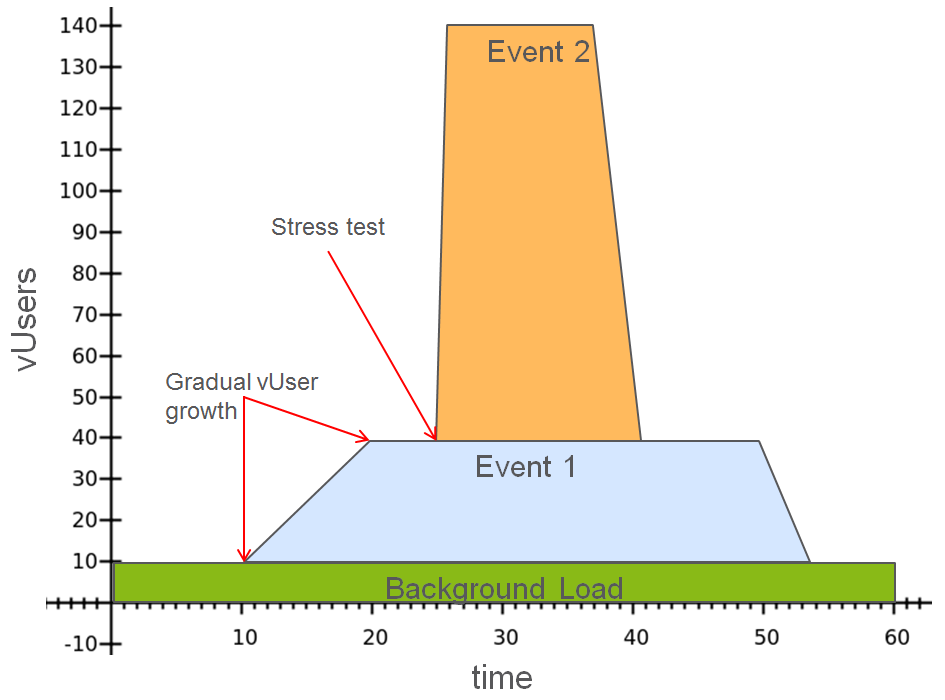

<head>
   <title>Scenarios - Performance Testing Using Scenarios</title>
</head>

# Performance Testing Using Scenarios

Scenarios have methods to repeat Flow multiple times and/or for a time period; pause between flow start and iterations; and add vUsers gradually.
These methods could be used for [performance testing](https://taf.seli.wh.rnd.internal.ericsson.com/performance/snapshot/index.html).

## Synchronization

Important thing to note, is that **subflow execution is synchronized**. 
 
### Subflow Synchronization

Because [subflows](https://taf.seli.wh.rnd.internal.ericsson.com/userdocs/snapshot/taf_concepts/taf_scenarios/extending_scenarios.html#Adding_Multiple_Flows) 
may have [shared Data Source](https://taf.seli.wh.rnd.internal.ericsson.com/userdocs/Latest/taf_concepts/taf_scenarios/manipulating_data.html#Shared_Data_Source)
 set, all subflow vUsers should start at the same time. Additionally Flows may have [Before and After Steps](#https://taf.seli.wh.rnd.internal.ericsson.com/userdocs/Latest/taf_concepts/taf_scenarios/flow.html#Before_Flow__After_Flow) defined which should execute only once, regardless of vUser count. Because of those reasons, **Subflow start is synchronized** i.e. all parent Flow Test Steps *before* sublow must complete before subflow Test Steps start.

```java
    TestScenario scenario = scenario()
            .addFlow(flow("")
                    .addTestStep(step("flow-ts1"))
                    .addTestStep(step("flow-ts2"))
                    .addSubFlow(flow("")
                            .beforeFlow(shareDataSource("subFlowDs"))
                            .addTestStep(step("subFlow-ts1"))
                            .withDataSources(dataSource("subFlowDs"))
                    )
                    .addTestStep(step("flow-ts3"))
                    .withVusers(2)
            )
            .build();
```


## Repeating flow
 
In performance Tests, a common requirement is to repeat Flow in loop: 

* `TestStepFlowBuilder.withIterationsPerVuser(long iterations)` will repeat given Flow for specified number of times.
Same behavior as with **Data Sources**. If combined with Data Sources, Flow will be repeated `[Data Record count in Data Source] * [iterations count]` for each vUser.
* `TestStepFlowBuilder.withDuration(long duration, TimeUnit unit)` will repeat given Flow for specified time. Does not
terminate Flow, so after duration ends all Test Steps will complete, and Data Records processed.
* `TestStepFlowBuilder repeatWhile(Predicate condition)` will repeat given Flow while predicate returns `true`. Predicate will be
called with [TestStepFlow.State](https://taf.seli.wh.rnd.internal.ericsson.com/apidocs/Latest/com/ericsson/cifwk/taf/scenario/TestStepFlow.State.html)
argument, which contains information about current vUser execution, such as iteration number and start time. If predicate
uses mutable external variables, it is up to user to ensure thread safety requirements.

If more than one repeat condition mentioned above is defined on Flow, whichever is reached first determines when to stop repetitions.

## Defining vUser Ramp Up

Ramp Up is needed to gradually increase number of simultaneously running vUsers from zero to number specified in <span style="color:#ba3925;">TestStepFlowBuilder.withVusers(int)</span>. This may be
useful to simulate real life scenarios on SUT and avoid too large workload at the start of a test. There are different strategies how to start vUsers.

**<span style="color:#ba3925;">Ramp Up for duration</span>**

All vUsers will be started linearly during defined time period.

```java
import static java.util.concurrent.TimeUnit.MILLISECONDS;
import static com.ericsson.cifwk.taf.scenario.api.RampUp.during;

//...

TestScenario scenario4 = scenario("performance")
        .addFlow(
                flow("background load")
                        .addTestStep(performance())
                        .withRampUp(during(100, SECONDS)) // see static imports above
                        .withDuration(200, SECONDS)
                        .withVusers(50)
        )
        .build();
```java

In example above Ramp Up 50 users in 100 seconds. Each 2 seconds (100/50=2) only one vUser will start execution to simulate gradual growth of load on SUT. vUser growth
will be following:


## Ramp Up x vUsers every y seconds

It is possible to define how much users start at once. For example to start 5 users every 10 seconds:

```java
import static java.util.concurrent.TimeUnit.MILLISECONDS;
import static com.ericsson.cifwk.taf.scenario.api.RampUp.vUsers;

//...

TestScenario scenario4 = scenario("performance")
        .addFlow(
                flow("background load")
                        .addTestStep(performance())
                        .withRampUp(vUsers(5).every(10, SECONDS)) // see static imports above
                        .withDuration(200, SECONDS)
                        .withVusers(50)
        )
        .build();
```java

Users will be started during (45/5) * 10 = 90 seconds (45 because first 5 users will start immediately).


## Pause

It is possible to do pause between Test Steps and Flow Iterations using <span style="color:#ba3925;">TestStepFlowBuilder.pause(long pause, TimeUnit unit)</span> If its needed to add delay
before Flow (i.e. start Flow after some time), but not between iterations its possible to do <span style="color:#ba3925;">.beforeFlow(TestScenarios.pause(pause(long pause, TimeUnit unit))</span> in
before Flow method.

## Advanced Examples

Using existing Scenario API ( **split**, **subFlow**, **dataSource** ) it is possible to simulate complex Performance Test Cases.

**<span style="color:#ba3925;">Example 1</span>**

Following performance scenario:

* Simulate background load with 10 vUsers on SUT for hour

* In 10 minutes from start gradually grow vUser count to 40 adding new vUser every 10 seconds

* In 20 minutes add 100 vUsers simultaneously to do stress test

Can be achieved using following code:

```java
TestScenario Scenario = scenario("performance")
        .split( // start Flows `background load`, `event 1` and `event 2` in parallel
                flow("background load")
                        .addTestStep(backgroundLoad())
                        .withDuration(1, HOURS)
                        .withVusers(10),
                flow("event 1")
                        .beforeFlow(TestScenarios.pause(10, MINUTES))
                        .addTestStep(event1())
                        .withRampUpTime(5, MINUTES)
                        .withVusers(30),
                flow("event 2")
                        .beforeFlow(TestScenarios.pause(20, MINUTES))
                        .addTestStep(event1())
                        .withVusers(100)
        )
        .build();
```java

VUser count during execution will look following:



**<span style="color:#ba3925;">Example 2</span>**

* Simulate background load with 10 vUsers on SUT for hour

* Call some event every 10 minutes (after previous event finishes)

```java
    TestScenario scenario2 = scenario("performance2")
            .split(
                    flow("background load")
                            .addTestStep(backgroundLoad())
                            .withDuration(1, HOURS)
                            .withVusers(10),
                    flow("event")
                            .pause(10, MINUTES)
                            .addTestStep(event1())
                            .withDuration(1, HOURS)
                            .withVusers(20)
            )
            .build();
```java

VUser count during execution will look like the following:


